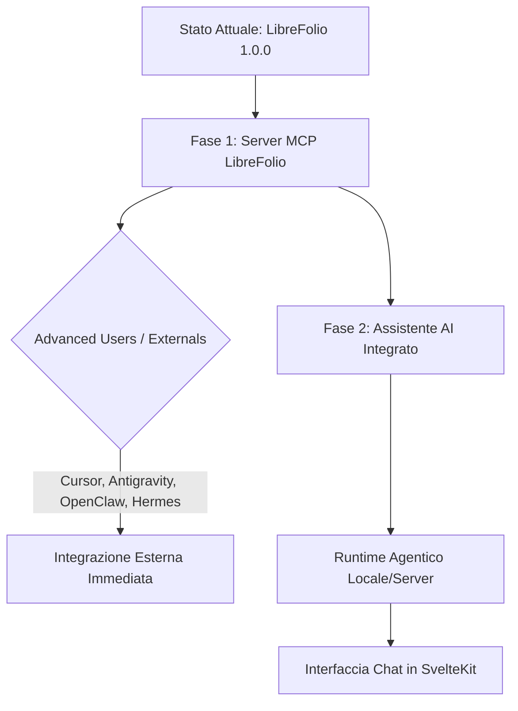

# Brainstorming: LibreFolio AI Agent & Risk Analysis Integration

Questo documento analizza l'architettura, le tecnologie e la roadmap per l'integrazione di funzionalità AI e di analisi di rischio (es. simulazioni Monte Carlo) in LibreFolio, puntando alla prossima major release (**Release 2.0.0**).

---

## 1. Vision & Obiettivi Chiave

L'obiettivo è trasformare LibreFolio da una dashboard di finanza personale passiva ad un **assistente finanziario agentico e predittivo**. L'utente deve poter sia interagire tramite un'interfaccia chat/AI, sia "giocare" visivamente con cruscotti interattivi basati sulle simulazioni di rischio.

### Capacità Fondamentali dell'Agente:
1. **Accesso Totale ai Dati (CRUD & Query):** Leggere lo stato del portafoglio, calcolare metriche storiche, e inserire/modificare asset, transazioni o tassi forex.
2. **Code Interpreter (Python):** Eseguire codice Python al volo per calcoli complessi (es. Monte Carlo, ottimizzazione di portafoglio di Markowitz, calcolo dell'Indice di Sharpe, simulazioni di prelievo sicuro in pensione/FIRE).
3. **Agentic Web Search:** Effettuare ricerche mirate online su notizie macroeconomiche, ticker sconosciuti, dati storici di mercato o variazioni normative.
4. **Indipendenza da Big Tech (Open-Source & Privacy):** Funzionamento basato su modelli open-source stabili ed esecuzione locale o auto-ospitata.

---

## 2. Roadmap Incrementale Proposta

Per consentire uno sviluppo agile, testabile e con un time-to-market ridotto per la community, si propone una roadmap in due fasi principali.



### Fase 1: Server MCP (Model Context Protocol) LibreFolio
Invece di costruire subito un intero sistema agentico custom, iniziamo esponendo i dati e le funzionalità di LibreFolio tramite un server **MCP (Model Context Protocol)**.

* **Come Funziona:** Un server MCP (scritto in Python usando `fastmcp` o `mcp-python-sdk`) gira come processo sidecar o integrato nel backend di LibreFolio. Espone tool specifici per leggere/scrivere transazioni, asset, e forex.
* **Vantaggi di questa scelta:**
  * **Zero Overhead di UI/Memory:** Non dobbiamo implementare da subito chat, gestione della memoria, cron o gestione dell'LLM.
  * **Utilizzo Immediato:** Gli utenti avanzati possono agganciare il server MCP di LibreFolio al proprio client preferito (Cursor, Antigravity, Windsurf, OpenClaw, Hermes Agent).
  * **Feedback Rapido:** Permette di testare l'efficacia e la robustezza delle API prima di integrarle nella UI ufficiale.
  * **Valore Commerciale/Marketing:** Offre una "killer feature" per sviluppatori e power user fin da subito.

### Fase 2: Assistente AI Integrato & UI
Una volta stabilizzate le API MCP, sviluppiamo il nostro **Harness / Assistente Integrato** direttamente all'interno dell'applicazione, sfruttando l'architettura di agenti open-source esistenti.

* **La Base di Partenza:** Evoluzione o integrazione di **Hermes Agent** (Nous Research, Febbraio 2026) o **OpenClaw**.
  * **Hermes Agent (Consigliato):** È scritto in Python, gestisce la memoria persistente tramite SQLite (FTS5 search), ha un ciclo di auto-miglioramento delle abilità ("Skills loop") e un cron scheduler nativo. Essendo LibreFolio basato su Python nel backend, l'integrazione di Hermes Agent come runtime interno risulta estremamente naturale.
  * **OpenClaw:** È basato su Node.js ed è orientato all'automazione locale. Può essere un'ottima alternativa se si preferisce spostare la logica dell'agente sul lato frontend/desktop.

---

## 3. Motore AI & LLM Engine: Dove risiede l'intelligenza?

Per garantire l'indipendenza dai grandi provider cloud pur offrendo flessibilità, dobbiamo supportare sia API commerciali (per chi desidera la massima precisione) sia motori locali open-source (per la massima privacy).

### A. Opzioni Cloud-Agnostiche / Open-Source
* **OpenRouter / Doubleword:** Ottimi intermediari. Permettono di cambiare modello (es. DeepSeek-V3, Llama 3, Qwen) tramite un'unica API standard, pagando solo al consumo senza legarsi a OpenAI o Anthropic.
* **GitHub Copilot CLI / Copilot API:** Non esiste una API generica per utilizzare Copilot come LLM raw per agenti terzi (violerebbe i ToS ed è limitata all'ambiente di sviluppo). Esiste però un SDK per far cooperare agenti complessi con il runtime di Copilot per compiti di programmazione. **Non raccomandato per l'assistente finanziario finale**, ma utile solo durante la scrittura del codice di LibreFolio.

### B. Esecuzione Locale (Local-First)
* **Ollama (Consigliato per Sviluppo/Singolo Utente):** Fornisce un'API locale compatibile con OpenAI. È facilissimo da installare su macOS/Linux/Windows ed è perfetto per far girare modelli come `Llama-3-8B-Instruct` o `Qwen-2.5-Coder` sulla macchina dell'utente.
* **vLLM (Consigliato per Server Centralizzati):** Se LibreFolio viene offerto come servizio hosted multi-utente, vLLM è lo standard industriale per servire modelli locali con elevato throughput e gestione efficiente della memoria cache (PagedAttention).

---

## 4. Architettura di Presenza dell'AI: Browser vs Server

La scelta di dove far girare l'agente e l'LLM influisce su privacy, costi di gestione e requisiti hardware.

| Dimensione | AI nel Browser (Client-Side) | AI nel Server (Server-Side / Local Host) |
| :--- | :--- | :--- |
| **Tecnologia** | WebGPU (Transformers.js, WebLLM), Pyodide (Python WASM). | FastAPI Background Tasks, Python locale, Ollama/vLLM, SQLite. |
| **Privacy** | **Massima.** Nessun dato finanziario lascia il browser dell'utente. | **Media/Alta.** I dati rimangono sulla macchina se ospitato localmente, altrimenti vanno sul server. |
| **Requisiti Hardware** | Elevati per l'utente (richiede Apple Silicon o GPU dedicate). | Minimi per l'utente, spostati sul server o sulla macchina host locale. |
| **Prestazioni** | Limitate dalla dimensione dei modelli (max 1.5B - 3B parametri). | Ottime (può scalare a modelli da 8B, 14B o 70B parametri). |
| **Funzionalità Offline** | Sì, dopo aver scaricato i pesi del modello. | No (a meno che anche il server/Ollama non sia sulla stessa rete locale). |
| **Attività in Background (Cron)**| Difficili. L'applicazione deve rimanere aperta nel browser. | **Facili.** Gli agenti persistenti (Hermes) possono girare in background anche a browser chiuso. |

### Raccomandazione: Approccio Ibrido "Local-Server"
Dato che LibreFolio ha già un backend Python separato dal frontend SvelteKit, la soluzione migliore è posizionare il **Runtime dell'Agente nel Backend Python (Server-side locale)**.
* L'utente esegue LibreFolio localmente (Docker o dev mode).
* Il backend Python ospita sia le API FastAPI che l'agente (basato su Hermes).
* Il frontend SvelteKit offre una chat elegante e interattiva che comunica con il backend tramite WebSocket o Server-Sent Events (SSE).
* Questa soluzione permette all'agente di eseguire script Python in sicurezza, mantenere la memoria nel database SQLite locale e girare compiti in background (cron) per allarmi o report periodici.

---

## 5. Agentic Internet Search: Ricerche Web Autonome e Private

La capacità di effettuare ricerche sul web è essenziale per raccogliere dati finanziari freschi. Per rimanere indipendenti dai provider commerciali (come Tavily o Exa), dobbiamo puntare su soluzioni open-source e auto-ospitate.

### A. La Scelta Principale: SearXNG (Self-Hosted)
**SearXNG** è un motore di meta-ricerca open-source e focalizzato sulla privacy.
* **Come Funziona:** Interroga oltre 70 motori di ricerca esterni (Google, Bing, Yahoo, DuckDuckGo) fungendo da proxy anonimo. L'agente non rivela mai l'IP o i dati dell'utente ai motori di ricerca.
* **Integrazione con l'Agente:** L'agente effettua richieste HTTP a SearXNG abilitando il formato JSON nel file di configurazione (`settings.yml`):
  ```yaml
  search:
    formats:
      - html
      - json
  ```
  L'LLM riceve i risultati strutturati e seleziona i link migliori da approfondire.

### B. Web Scraping & Conversione: Playwright & Firecrawl (Self-Hosted)
I risultati di ricerca contengono solo snippet. Per permettere all'agente di "leggere" gli articoli di finanza o i report:
* **Firecrawl (Self-Hosted):** Un tool open-source eccezionale che prende un URL, supera i controlli anti-bot e restituisce la pagina convertita in un Markdown pulito, ideale per il contesto dell'LLM.
* **Playwright (Python):** Se vogliamo evitare servizi esterni, possiamo usare Playwright direttamente dal nostro backend per fare lo scraping headless delle pagine web.

---

## 6. Code Execution & Simulazioni Monte Carlo

La vera potenza dell'AI finanziaria sta nella capacità di scrivere codice per eseguire calcoli complessi al posto dell'utente.

### A. Simulazione Monte Carlo e Risk Analysis
* **Cos'è:** Una tecnica matematica che calcola la probabilità di diversi risultati proiettando migliaia di scenari futuri basati su variabili storiche (rendimento medio, volatilità, inflazione).
* **Interazione AI-UI:**
  1. **AI:** L'utente chiede nella chat: *"Che probabilità ho di finire i soldi in 30 anni se prelevo il 4% all'anno partendo dal mio portafoglio attuale?"*
  2. **Code Execution:** L'agente genera ed esegue uno script Python che simula 10.000 scenari usando le librerie matematiche del backend.
  3. **Visualizzazione UI:** L'agente restituisce i dati grezzi in JSON al frontend SvelteKit, che renderizza dinamicamente un grafico interattivo (es. curve di probabilità, ventaglio di simulazioni) permettendo all'utente di "giocherellare" con gli slider (variazione tasso di prelievo, allocazione asset) per vedere come cambia il rischio.

### B. Sicurezza della Code Execution (Sandbox)
Far eseguire codice arbitrario generato da un LLM sul computer dell'utente è un rischio di sicurezza enorme. Dobbiamo isolare l'esecuzione:
1. **WASM-based Python (Client-side):** Utilizzare **Pyodide** nel browser. Il codice Python gira all'interno della sandbox protetta del browser. Non può accedere ai file locali dell'utente se non autorizzato.
2. **Docker Sandbox (Backend):** Eseguire lo script all'interno di un container Docker isolato e temporaneo con risorse limitate (senza accesso alla rete o al file system host).
3. **Restricted Python REPL:** Utilizzare interpreti Python blindati che disabilitano librerie pericolose (es. `os`, `subprocess`, `sys`), sebbene questo approccio sia storicamente difficile da rendere sicuro al 100%.

---

## 7. Proposta di Roadmap Dettagliata per gli Step Successivi

### Step 1: Creazione del Server MCP LibreFolio
1. Sviluppare un modulo `mcp_server.py` nel backend Python.
2. Implementare i tool MCP di lettura (get_portfolio, get_assets, get_transactions, get_forex_rates).
3. Implementare i tool MCP di scrittura (add_transaction, add_asset, update_settings) dotati di validazione dei dati.
4. Consentire l'avvio dell'MCP tramite un comando CLI (es. `python dev.py mcp-start`).

### Step 2: UI di Configurazione e Chat in LibreFolio
1. Creare una pagina di impostazioni AI in LibreFolio per inserire le chiavi API (OpenRouter, OpenAI) o l'endpoint locale (Ollama/SearXNG).
2. Sviluppare una chat sidebar o una dashboard dedicata all'assistente in SvelteKit.
3. Creare un protocollo di comunicazione (WebSocket/SSE) tra il frontend e l'agente locale.

### Step 3: Integrazione del Code Interpreter & Risk Analytics
1. Creare l'ambiente di sandboxing per Python.
2. Sviluppare template di codice matematico per l'agente (Monte Carlo, Sharpe Ratio, frontiera efficiente).
3. Sviluppare i componenti grafici svelte interattivi per visualizzare i risultati delle simulazioni.
