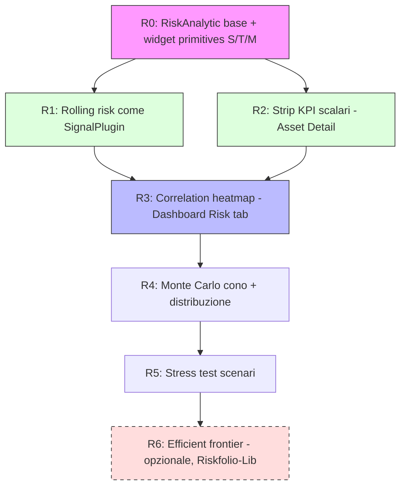

# Analisi — Modularità e Posizionamento della Risk Analysis (Fase 0.1)

> **Domanda a cui questo documento risponde:** l'analisi del rischio può essere
> resa *modulare* come il sistema dei segnali tecnici, oppure ogni metrica di
> rischio richiede necessariamente una UI costruita ad-hoc? E, di conseguenza,
> *dove* nel progetto ha senso collocarla?

---

## 1. Il contesto: cosa rende modulari i "segnali"

Il sistema segnali (EMA, RSI, MACD, Bollinger, + ~15 plugin backend in
`backend/app/services/signal_plugins/`) è modulare perché tutti i segnali
condividono **la stessa forma di input e di output**:

- **Input uniforme:** una singola serie temporale `prezzo(t)`.
- **Output uniforme:** una o più serie allineate all'**asse tempo**, che si
  disegnano *sullo stesso grafico 2D tempo/prezzo* (overlay sull'asse primario,
  oppure oscillatore su un asse secondario/terziario).

Questa uniformità è ciò che permette l'auto-discovery: `ChartSignal` (frontend) e
`SignalPlugin` (backend) dichiarano `params_schema` + `output_specs`, e la UI
renderizza tutto con **un solo renderer** (il grafico a linee/istogramma).

> **Insight:** la modularità dei segnali non nasce dalla matematica, ma dal fatto
> che **l'output ha sempre la stessa forma grafica**. È la forma dell'output a
> determinare se qualcosa è "pluggable".

---

## 2. Il rischio ha output eterogenei → tassonomia degli archetipi

A differenza dei segnali, le metriche di rischio producono forme grafiche
**diverse tra loro**. Classificandole per *forma di output*, emergono **6
archetipi** (e non infiniti casi ad-hoc):

| # | Archetipo output | Esempi di metriche | Widget di rendering |
|---|------------------|--------------------|--------------------|
| **S** | **Scalare** (1 numero + banda qualitativa) | Volatilità annua, Sharpe, Sortino, Max Drawdown, VaR, CVaR, Beta, CAGR | KPI card / cella tabella + gauge |
| **T** | **Serie temporale** (allineata all'asse tempo) | Rolling volatility, Drawdown underwater, Rolling Sharpe, Rolling Beta, Rendimento rolling N-periodi | **Grafico segnali esistente** |
| **D** | **Distribuzione 1D** (istogramma / densità) | Distribuzione dei rendimenti, visualizzazione VaR, valore terminale Monte Carlo | Widget istogramma |
| **C** | **Cono / fan chart** (tempo + bande di incertezza) | Proiezione Monte Carlo, percentili P5/P50/P95 | Chart a bande (riusa il rendering Bollinger!) |
| **M** | **Matrice NxN** (heatmap) | Correlazione, covarianza, matrice beta | Heatmap |
| **F** | **Scatter 2D** (rischio/rendimento) | Frontiera efficiente (Markowitz), risk-return plot | Scatter + curva |

Sono **6 forme, non 60 casi**. Questo è il punto centrale della risposta.

---

## 3. Risposta alla domanda: né "tutto ad-hoc" né "un plugin unico"

La modularità è possibile, ma **a un livello diverso** rispetto ai segnali. Non si
rende modulare *il grafico a linee*; si rende modulare **la libreria di widget di
output** (le "widget primitives"). Ogni nuova metrica dichiara:

1. **quale archetipo di output** produce (S/T/D/C/M/F);
2. **su quale scope** opera (`asset` singolo, `portfolio`, `broker`, `subset`);
3. il proprio **`params_schema`** (orizzonte, confidence level, n. simulazioni…).

La UI **auto-seleziona il widget** dall'archetipo, esattamente come oggi
`ChartSignal` auto-seleziona il renderer dal tipo di segnale. Si passa da
"1 renderer / N segnali" a "**6 renderer / N metriche**".

### Proposta architetturale: `RiskAnalytic` plugin (mirror di `SignalPlugin`)

```
backend/app/services/risk_plugins/
├── base.py            # class RiskAnalytic(ABC)
│                      #   output_kind: OutputKind   # SCALAR|SERIES|DISTRIBUTION|CONE|MATRIX|SCATTER
│                      #   scopes: tuple[RiskScope]   # ASSET|PORTFOLIO|BROKER|SUBSET
│                      #   params_model: BaseModel
│                      #   def compute(returns, weights, params, ctx) -> RiskResult
├── volatility.py      # SCALAR + SERIES (rolling)
├── drawdown.py        # SCALAR (maxDD) + SERIES (underwater)
├── sharpe.py          # SCALAR + SERIES (rolling)
├── var_cvar.py        # SCALAR + DISTRIBUTION
├── correlation.py     # MATRIX
├── monte_carlo.py     # CONE + DISTRIBUTION (valore terminale)
├── stress_test.py     # SCALAR set (scenari)
└── efficient_frontier.py  # SCATTER   (avanzato/opzionale)
```

```
frontend/src/lib/risk/widgets/
├── ScalarKpi.svelte        # archetipo S  (numero + gauge + banda)
├── RiskSeriesChart.svelte  # archetipo T  → riusa il chart dei segnali
├── DistributionChart.svelte# archetipo D
├── ConeChart.svelte        # archetipo C  → riusa band rendering di Bollinger
├── CorrelationHeatmap.svelte# archetipo M
└── FrontierScatter.svelte  # archetipo F
```

> **Regola di evoluzione congiunta** (come da `mcp_server_architecture_draft.md`):
> la matematica vive **solo nel service layer** (`RiskAnalytic.compute`), così
> REST, MCP e futura chat AI ne beneficiano senza duplicazioni.

---

## 4. Il regalo nascosto: molte metriche di rischio SONO GIÀ segnali

L'archetipo **T (serie temporale)** non richiede alcuna infrastruttura nuova: è
già coperto dal sistema `SignalPlugin` esistente. Queste metriche possono essere
implementate **come nuovi signal plugin** e comparire nel grafico Asset Detail /
FX senza una riga di UI nuova:

| Metrica | Categoria segnale | Asse | Note |
|---------|-------------------|------|------|
| **Drawdown underwater** | `risk` (nuova) | secondario (0 → -X%) | Classico, leggibile a colpo d'occhio |
| **Rolling volatility (Nd)** | `risk` | secondario | Mostra i cambi di regime |
| **Rolling Sharpe (Nd)** | `risk` | secondario | "Il rendimento valeva il rischio?" |
| **Rolling Beta vs benchmark** | `risk` | secondario | Riusa il sistema "asset di comparazione" |
| **Rendimento rolling N-periodi** | `risk` | primario % | Già previsto in roadmap Fase 0 §4 |

**Raccomandazione:** introdurre una nuova `SignalCategory = "risk"` e implementare
questi 5 come signal plugin. È il **quick win** con il rapporto valore/costo più
alto dell'intera Fase 0.1.

---

## 5. Matrice di posizionamento UI (per pagina, con riferimenti alla gallery)

Riferimenti agli screenshot in `mkdocs_src/docs/gallery/desktop/en/light/`.

| Pagina (screenshot) | Scope naturale | Cosa collocare | Archetipi |
|---------------------|----------------|----------------|-----------|
| **Asset Detail** — accordion `Signals` + `Measures` (`assets/detail-measures.png`, `assets/detail-signals-macd.png`) | `asset` | Rolling risk come segnali nel chart esistente; nuova **tab chart "Projections/Risk"** con strip KPI (Vol, MaxDD, Sharpe, VaR, CAGR) + Monte Carlo cono + distribuzione rendimenti | T, S, C, D |
| **Dashboard** — tab Overview/Positions/Transactions (`dashboard/main.png`, `dashboard/positions-performance-map.png`) | `portfolio` | **Nuova tab "Risk"** accanto alle esistenti: heatmap correlazione, cono Monte Carlo di portafoglio, griglia KPI di rischio, scenari stress test | M, C, S |
| **Dashboard** — KPI cards in alto (`dashboard/allocation-charts.png`) | `portfolio` | 4ª card "Risk" (Volatilità / Max DD / Sharpe) con sparkline | S |
| **Broker Detail** — tab Info/Positions/Transactions + FIFO (`brokers/detail.png`, `brokers/positions-performance-map.png`) | `broker` | Stesso pattern "Risk tab" ma scoped agli asset di quel broker → correlazione **interna al broker** | M, S, C |
| **Positions holdings/performance map** (treemap) (`dashboard/positions-performance-map.png`) | `portfolio` | Variante "**Risk contribution map**": dimensione/colore = contributo al rischio invece che al valore | (riuso treemap) |

> **Perché la "Risk tab" e non una pagina nuova:** la Dashboard ha già il pattern
> a tab (Overview/Positions/Transactions) con selettore periodo, valuta e broker
> in cima. Una tab "Risk" eredita **gratis** questi filtri (periodo → finestra di
> stima; broker → scope; valuta → base). Coerenza totale, zero navigazione nuova.

---

## 6. Cosa implementare / cosa rimandare / cosa NON mettere in UI

### ✅ Implementare subito (alto valore, basso costo, forma nota)
- **Rolling risk come segnali** (§4) — riuso puro.
- **Strip KPI scalari** (Vol, MaxDD, Sharpe, Sortino, VaR, CVaR, CAGR) — `numpy`.
- **Matrice di correlazione** (heatmap) — l'"aha moment" sulla diversificazione.
- **Drawdown underwater** — leggibilità immediata del "dolore" storico.

### 🟡 Implementare in un secondo momento (alto valore, costo medio)
- **Monte Carlo cono + distribuzione valore terminale** — molto ingaggiante ma
  richiede il nuovo `ConeChart` (mitigato: riusa band-rendering di Bollinger).
- **Stress test scenari storici** (2008, COVID, +200bps rates) — storytelling
  potente; costo = curare il dataset degli scenari.

### 🟠 Avanzato / opzionale (potente ma rischioso per il target retail)
- **Frontiera efficiente / ottimizzazione Markowitz** (Riskfolio-Lib): matematica
  soggetta a *estimation error*, facilmente mal interpretata da utenti retail.
  Va accompagnata da disclaimer chiari e non deve suggerire operazioni in modo
  imperativo. Proporla come "Advanced" collassata di default.

### ❌ Non mettere in UI (tenere solo backend / esporre via MCP all'AI)
- Misure di rischio esotiche (EVaR, CDaR, misure basate su kurtosi), modelli
  fattoriali, ottimizzazioni multi-vincolo. Sovradimensionate per il target;
  restano disponibili all'agente AI come tool MCP, senza inquinare la UI.

---

## 7. Scelta della libreria: Riskfolio-Lib vs numpy/pandas

`Riskfolio-Lib` è potente ma **pesante**: trascina `cvxpy` e solver di
ottimizzazione convessa. Il suo valore reale è l'**ottimizzazione di portafoglio**
(frontiera efficiente, allocazioni ottime) e le **misure di rischio avanzate** con
plotting integrato.

| Necessità | Libreria consigliata | Motivo |
|-----------|----------------------|--------|
| KPI scalari (Vol, Sharpe, Sortino, MaxDD, VaR, CVaR, CAGR) | **`numpy`/`pandas`** | ~10 righe ciascuna, zero dipendenze pesanti |
| Serie rolling (§4) | **`pandas`** (`.rolling()`, `.pct_change()`) | Già dipendenza |
| Matrice correlazione | **`pandas`** (`.corr()`) | Nativo |
| Monte Carlo (GBM) | **`numpy`** | Vettorizzato, veloce |
| **Frontiera efficiente / ottimizzazione** | **`Riskfolio-Lib`** | Qui la libreria vale il peso |

> **Raccomandazione:** iniziare **senza** Riskfolio-Lib (tutto in numpy/pandas che
> sono già dipendenze del backend), e introdurlo **solo** quando/se si implementa
> la frontiera efficiente. Evita di appesantire il Docker single-image per feature
> che l'80% degli utenti userà.

### ⚠️ Async safety (regola vincolante del progetto)
Tutti i calcoli di rischio sono **CPU-bound sincroni**. Negli handler `async def`
**devono** essere wrappati in `await asyncio.to_thread(...)` per non bloccare
l'event loop (Monte Carlo con 10k path e l'ottimizzazione convessa sono i casi più
critici). Vedi `.github/instructions/backend.instructions.md`.

---

## 8. Roadmap incrementale suggerita (per la Fase 0.1)



- **R0–R2** sbloccano subito valore con costo minimo (riuso + numpy).
- **R3** è il primo widget davvero "nuovo" (heatmap) ma ad altissimo impatto.
- **R6** è l'unico step che introduce Riskfolio-Lib, ed è opzionale.

---

## 9. Conclusione

L'analisi del rischio **non** richiede una UI ad-hoc ogni volta. Richiede di
identificare **6 forme di output** e costruire una piccola libreria di **widget
primitives** riusabili; a quel punto ogni metrica futura è un plugin
`RiskAnalytic` che dichiara forma + scope + parametri, esattamente come i segnali.
Una parte consistente (le metriche rolling) è **già** coperta dal sistema segnali
esistente. Il posizionamento naturale è: **segnali/tab-chart** per lo scope asset,
una **"Risk tab"** ereditata dal pattern Dashboard/Broker per lo scope
portafoglio/broker.

→ Concept visivi con ASCII art: [`brainstorm-phase01RiskUiConcepts.md`](./brainstorm-phase01RiskUiConcepts.md)
