# Proof of Concept - UI Mockups

This page collects the UI mockups generated for LibreFolio, along with the prompts used to create them.

---

## Logo Designs

### Prompt 1A: The Secure Shield

> Minimalist logo design for 'LibreFolio', a self-hosted financial tracking application. The icon should combine the concept of a secure vault or shield with financial growth. A stylized, solid dark forest green shield shape contains an upward-trending line graph or arrow rendered in a contrasting mint green color. Below the icon, the word 'LibreFolio' is written in a clean, modern, dark forest green sans-serif font. The background is a clean, solid cream off-white. The overall feeling should be trustworthy, professional, private, and open-source. Flat design.

### Prompt 1B: The Smart Ledger

> Minimalist logo design for 'LibreFolio'. The icon is a stylized open book or financial ledger viewed from above, rendered in solid dark forest green. The 'lines' on the right-hand page of the book are not straight text but instead form an upward-curving financial bar chart or growth graph, rendered in a contrasting mint green color, indicating knowledge leading to growth. Below the icon, the word 'LibreFolio' is written in a clean, modern, dark forest green sans-serif font. The background is a clean, solid cream off-white. Flat design, professional and smart.

### Prompt 1C: The Financial Shield

> Minimalist logo design for 'LibreFolio'. The central icon is a classic, solid shield shape in dark forest green, representing security and privacy. Centered prominently inside the shield is a stylized monogram letter 'L' (for LibreFolio) combined with an upward-pointing arrow, rendered in a contrasting mint green color, symbolizing protected growth. Below the shield icon, the word 'LibreFolio' is written in a clean, modern, dark forest green sans-serif font. The background is a clean, solid cream off-white. Flat design, strong and trustworthy.

### Refined Logo

---

## Authentication

### Login Screen

> Login screen for LibreFolio. Clean cream background with a centered card. The card contains the LibreFolio logo, and input fields for 'Username' and 'Password', along with a 'Login' button in dark forest green.

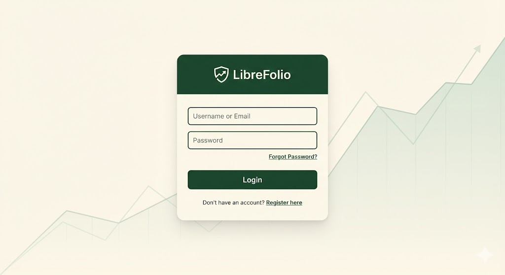
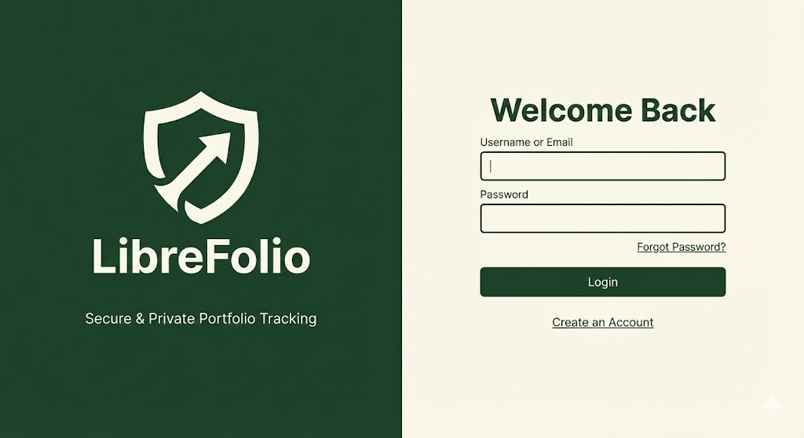

---

## Main Application Screens

### Dashboard (Desktop)

> Desktop UI mockup for 'LibreFolio' financial dashboard on a wide screen. The overall aesthetic is clean, modern, and minimalist, inspired by SvelteKit Skeleton UI. The background is cream off-white (#FDFBF7). On the left, there is a dark forest green (#1A4D3E) sidebar navigation menu with clean white icons and text labels for Dashboard, Holdings, Transactions, and Settings. The main content area features three large summary cards at the top with rounded corners: 'Total Net Worth €125,450.00' (with a small mint green upward arrow and +2.4%), 'Weighted ROI 8.2%', and 'Available Cash €5,300'. Below the cards, a large, clean line chart showing portfolio growth over the last 6 months with a soft green gradient fill. To the right of the line chart, a donut chart showing asset allocation (e.g., Stocks 50%, ETFs 30%, P2P Loans 20%).

### Dashboard (Mobile)

> Mobile phone UI mockup for the 'LibreFolio' financial app. iPhone screen format. The design is a responsive adaptation of the desktop dashboard with a cream background and dark green accents. At the very top, a dark forest green header bar shows the 'LibreFolio' logo and a menu icon. Below the header, a prominent display shows the main KPI: a large '€125,450.00' total balance with a smaller green '+2.4% Today' indicator underneath. Below this, a scrollable list of asset summary cards with rounded corners: 'VWCE ETF' showing a mini sparkline chart and current value, 'Bitcoin (BTC)' with its value, and 'P2P Loan Project Y' with a 'Repaying' status. At the bottom of the screen, a dark forest green navigation bar with white icons for Home, Portfolio, and a central '+' button for adding transactions.

### Portfolio Page

> Desktop UI mockup for the 'Portafoglio' (Portfolio) page of the LibreFolio app. The page has a cream background and the dark green sidebar on the left. The main content area features a large, detailed, clean data table (datagrid) with rounded corners listing current holdings. Columns include: Asset (with icon, e.g., 'Apple AAPL'), Quantity ('15'), Avg Price ('$140.00'), Current Price ('$175.50'), Total Value ('$2,632.50'), Day Change ('+1.2%' in green), and Total P/L ('+25.3%' in green). Rows show various assets like stocks, ETFs, and crypto with appropriate data, some showing green positive gains, others red negative losses. A search/filter bar is above the table. The aesthetic is clean Material UI.

### Asset Detail (Stock/ETF)

> UI mockup for a specific asset detail page within the 'LibreFolio' desktop app, focusing on a Stock investment (e.g., Apple, AAPL). The page has a cream background. The title at the top says 'Apple Inc. (AAPL)'. Below the title, a large, clean line chart shows the stock's price history for the last year.

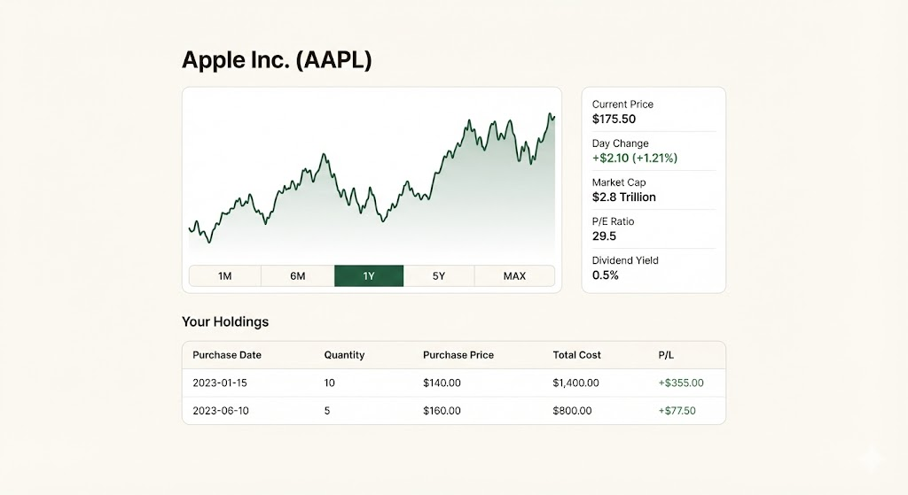

### Transactions Page

> Desktop UI mockup for the 'Transazioni' (Transactions) page of the LibreFolio app. Cream background, dark green sidebar. At the top of the main content, a filter bar with inputs for date range, transaction type, and asset search. Below it, a long, clean chronological list or table of financial transactions. Each row has an icon indicating type, date, description, and amount. Examples: A row with a green arrow up icon for 'BUY - VWCE ETF - 10 units @ €95.00 - Total -€950.00'; A row with a coin icon for 'DIVIDEND - Coca Cola - +€32.50'; A row with a red arrow down for 'SELL - Bitcoin - 0.1 BTC - Total +€3,800.00'. The amounts are colored green for inflows and grey/red for outflows.

#### Transaction Detail / Modal

### Cash Management Page

> Desktop UI mockup for the 'Cassa' (Cash) page of the LibreFolio app. Cream background, dark green sidebar. The top of the main area features two prominent rectangular cards with rounded corners displaying cash balances: one titled 'Euro Balance (Base)' showing '€ 5,300.00' and another titled 'USD Balance' showing '$ 1,250.50'. Below these cards, two large action buttons: a solid dark green one 'Add Funds (Deposit)' and an outlined one 'Withdraw Funds'. Below the buttons, a specific table titled 'Cash Movements Ledger' showing only money transfers, e.g., 'Date: 2023-11-20, Type: DEPOSIT, Amount: +€1,000', 'Date: 2023-11-15, Type: SETTLEMENT (Buy AAPL), Amount: -$450.00'.

### P2P Loan Asset Detail

> UI mockup for a specific asset detail page within the 'LibreFolio' desktop app, focusing on a P2P Loan investment. The page has a cream background. Title at the top says 'P2P Loan - Green Energy Fund #45'. Below the title, a prominent horizontal progress bar component shows the repayment status: 'Repaid: €450 / €1000 (45%)', with the repaid portion filled in solid mint green and the remaining in light grey. Below the progress bar, a clean, modern data table with rounded corners titled 'Amortization Schedule'. The table has columns for 'Date', 'Interest Paid', 'Principal Repaid', and 'Remaining Balance', showing numerical data rows. The aesthetic is clean, tabular data-driven, distinct from a stock price chart view.

### Reports Page

> Desktop UI mockup for the 'Report' page of the LibreFolio app. Cream background, dark green sidebar. The main content area has navigation tabs at the top: 'Performance', 'Income & Dividends', 'Realized Gains (Tax)'. The 'Performance' tab is active. Below the tabs, a large area chart shows the 'Portfolio Value Growth vs Benchmark (S&P500)' over 5 years, with two lines (one dark green for portfolio, one grey for benchmark). Below that, a section for 'Monthly Income', featuring a bar chart showing dividend payouts received each month for the current year, with bars of varying heights in mint green. A summary box next to it shows 'Total dividends YTD: €450.20'.

.png)

### Broker Management

> Desktop UI mockup for a 'Broker Management' page in the LibreFolio app. Cream background, dark green sidebar. The title is 'My Brokers'. The main content area displays a grid of cards, where each card represents a broker.

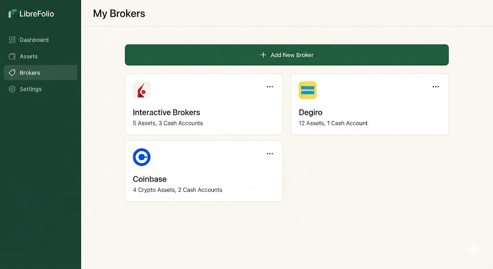
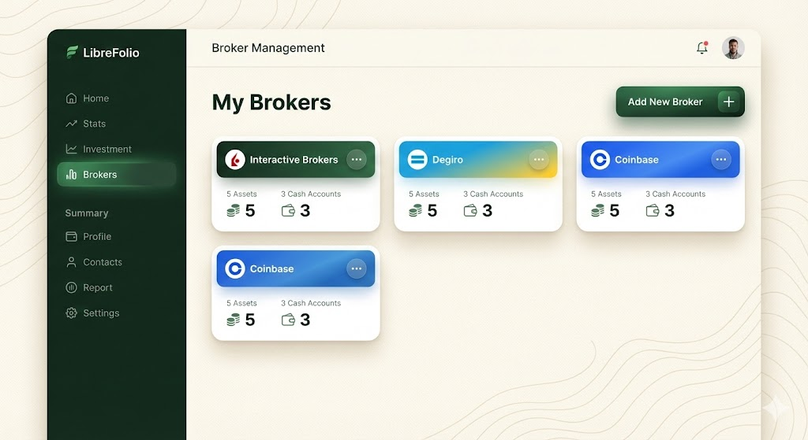
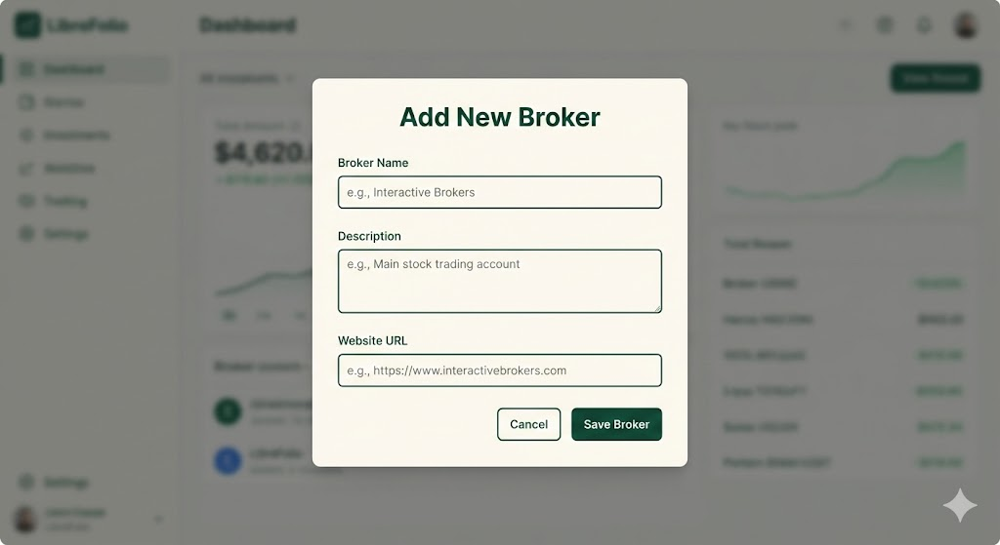

### FX Provider Management

> Desktop UI mockup for the 'Fx Provider Priorities' page in the LibreFolio app. Cream background, dark green sidebar. The page title is 'Gestione Priorità Tassi di Cambio (FX)'.

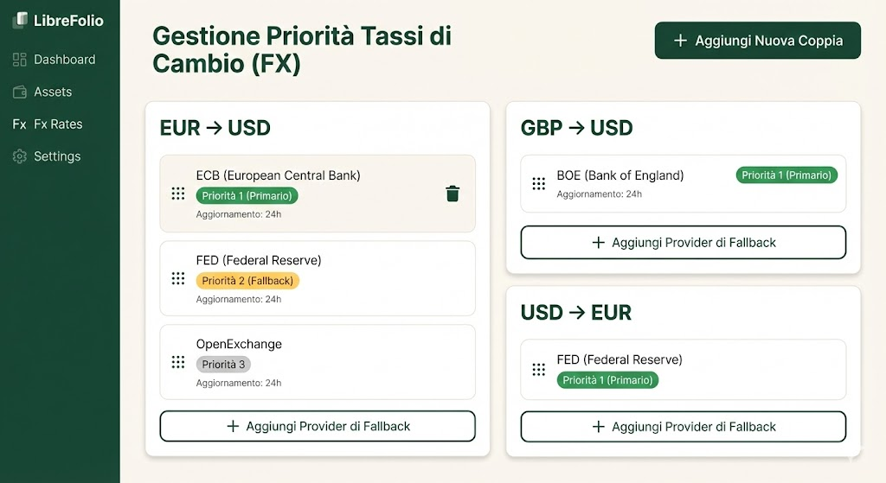
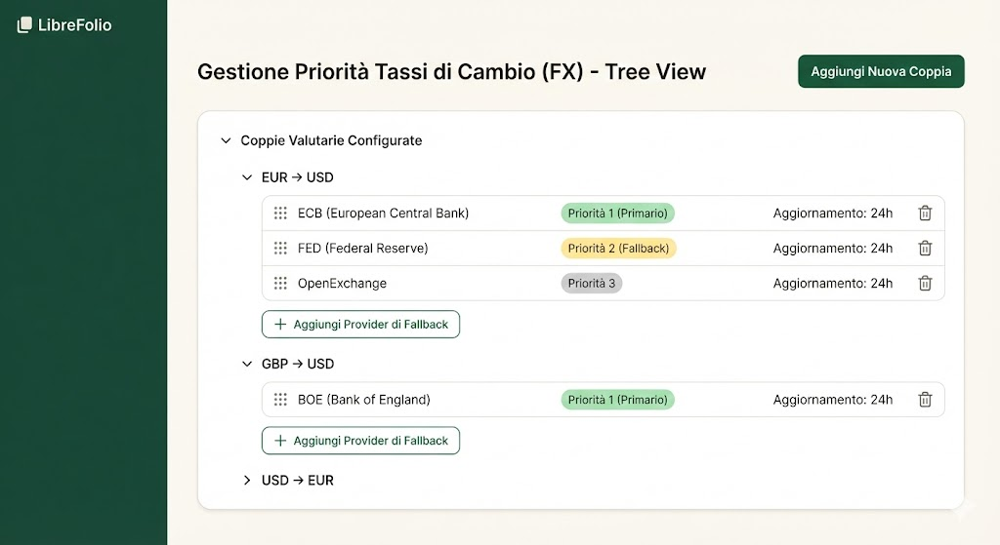
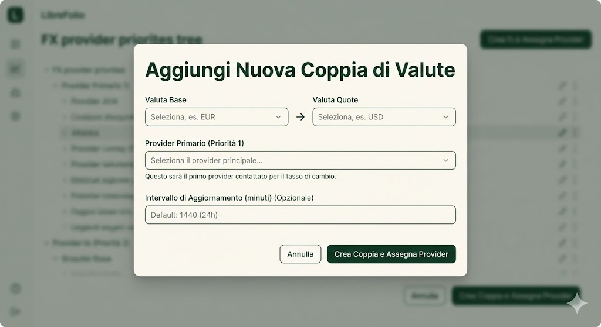
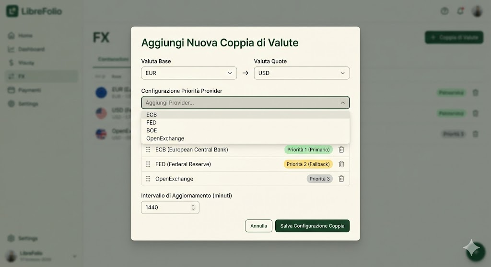

### Settings

> Desktop UI mockup for the 'Settings' page of the LibreFolio app. Cream background, dark green sidebar. The main content area is divided into sections with clear headings for User Profile, Application, API Access, and Data Management.

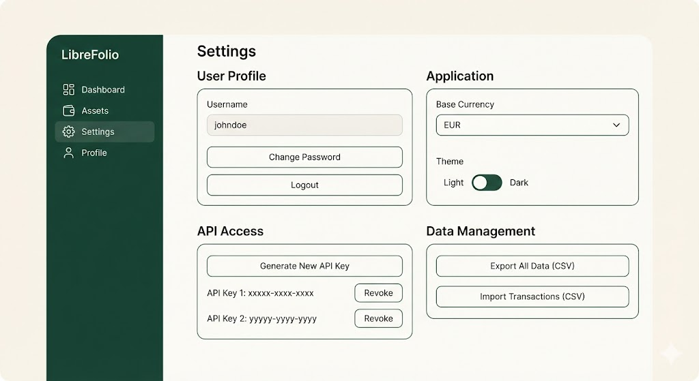

---

## Modals & Forms

### Add Transaction Modal

> UI design of a modal window overlay for 'Add Transaction' in the LibreFolio web app.

*(See "Main Application Screens" above)*

### Add New Asset Modal (with Provider Search)

> Desktop UI mockup of a modal window for 'Aggiungi Nuovo Asset' in the LibreFolio app, on a cream background.

---

## Design Elements

### Color Palette

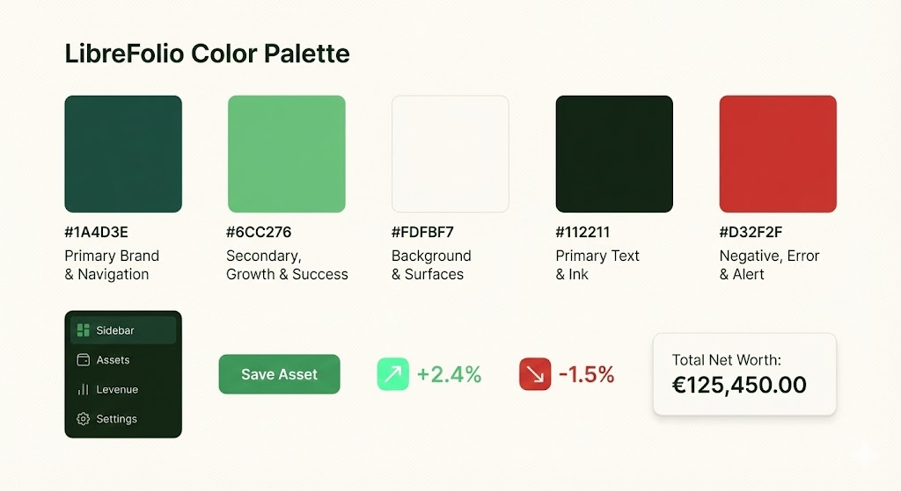

### Asset Icons

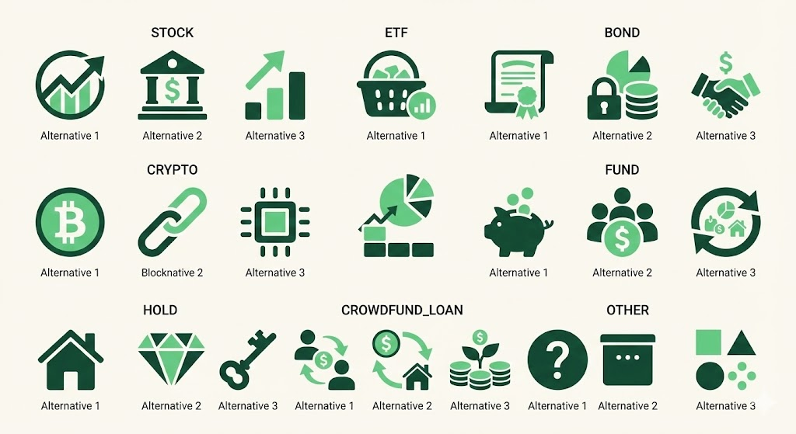
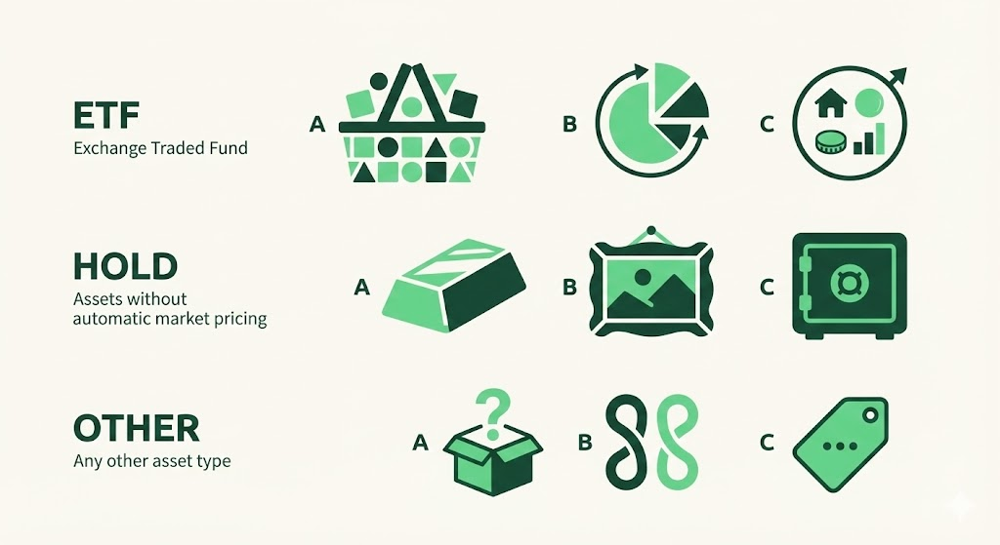
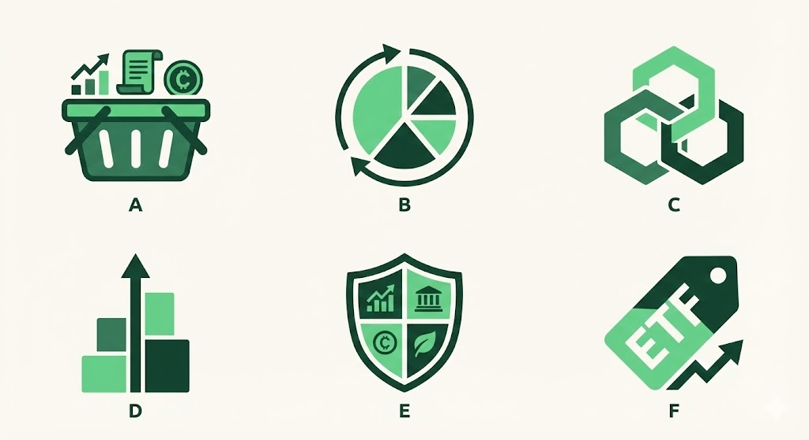
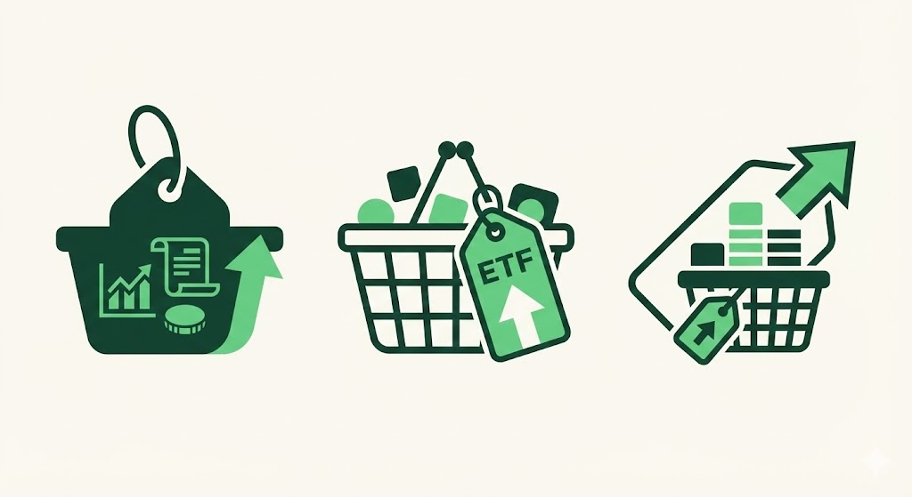
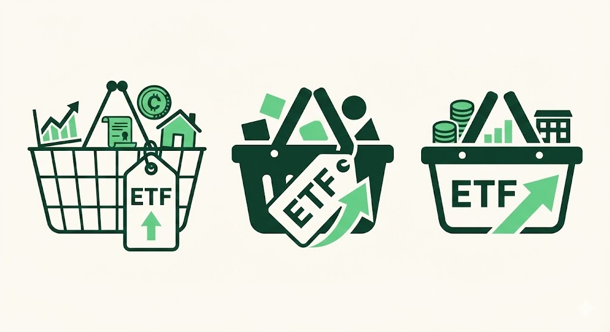
