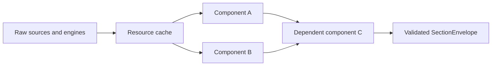

# 🧩 AI Export Composition and Prompt

AI Export composes small factual units instead of routing tasks through monolithic
profiles or domain assemblers.

## 🧱 ComponentSpec

A `ComponentSpec` is the smallest declarative runtime unit. It defines:

- stable `component_id` and implementation `version`;
- independent `schema_id` and `schema_version`;
- applicable domain;
- strict Pydantic `output_model`;
- sync or async builder;
- required component dependencies;
- period behavior and optional temporal aggregator metadata.

Dependencies are always required for the dependent component itself. Whether a
top-level failure is fatal depends on whether the dataset requested that component
as required or optional.



Every envelope carries `component_id`, component version, schema identity/version,
and a JSON-safe payload.

## ♻️ BuildContext and Resource Memoization

One `BuildContext` exists per snapshot request. It owns two separate caches:

1. **Component cache** — each component builds at most once, including shared
   dependencies.
2. **Typed resource cache** — raw reports, price/rate series, lots, and signal
   bundles are shared by builders but never serialized as sections.

Successes and failures are memoized. DB-backed resources use one request-scoped,
re-entrant-per-task lock because all builders share one `AsyncSession`.

The context also records price sampling, per-indicator sampling, event-selection
usage, and internal optional-component diagnostics.

## 📚 DatasetSpec and all_data

A `DatasetSpec` declares:

- domain, stable identity, version, i18n keys, icon, and applicable pages;
- required and optional component IDs;
- exact `section_order`;
- technical prerequisites and period semantics;
- supported detail levels.

`portfolio.all_data`, `broker.all_data`, `asset.all_data`, and `fx.all_data` are
computed unions of their domain's other datasets. They are not special builders.
The union:

- deduplicates by component ID;
- keeps a component required if any source dataset requires it;
- keeps it optional only when every source treats it as optional;
- uses canonical component-registry order.

## 🧠 AnalysisSpec

An `AnalysisSpec` declares required and optional datasets, applicable pages,
applicability code, and frontend contract identities:

- instruction template ID/version;
- response contract ID/version;
- user-note support.

The backend tracks these identities but does not own localized instruction text or
response formatting.

## 🧮 Composer Ordering and Deduplication

Composition is deterministic:

1. required datasets in analysis declaration order;
2. optional datasets in analysis declaration order;
3. each dataset's components in `section_order`;
4. shared envelopes deduplicated by `(component_id, component_version)`;
5. first occurrence wins.

For a direct dataset export, only that dataset is composed. For an analysis, the
composer returns the ordered union of every used dataset.

No token budget, payload size, or heuristic relevance rule changes this order.

## 🗺️ Applicability

| UI page | Runtime page slug | Domain | Available catalog types |
|---|---|---|---|
| Dashboard | `dashboard` | Portfolio | datasets and analyses |
| Broker | `broker` | Broker | datasets and analyses |
| Asset | `asset` | Asset | datasets and analyses |
| FX | `fx` | FX | datasets and analyses |

Static catalog applicability filters where an item may be offered. Runtime
applicability can additionally reject facts such as an Asset analysis requiring a
position or an FX analysis requiring direct exposure.

## 📝 Exact Prompt Order

### 📤 Export Data

Dataset selections produce `data_only`:

1. **Snapshot Metadata and Dataset Manifest**
2. **Snapshot Data**

No analysis objective, verification instructions, response contract, domain notes,
user notes, or response language is added.

### 🔬 Request Analysis

Analysis selections produce `full_prompt` in this exact order:

1. **Analysis Objective**
2. **Shared Verification Instructions**
3. **Response Contract**
4. **Snapshot Metadata and Dataset Manifest**
5. **Snapshot Data**
6. **Additional LibreFolio Data**
7. **Domain Notes**
8. **User Notes**, only when non-empty and supported
9. **Response Language**

Trusted frontend templates provide instructions. Snapshot values and user notes are
serialized inside fenced YAML data blocks.

## 📋 Manifests

`dataset_manifest` records what was actually composed:

```yaml
dataset_manifest:
  - dataset_id: portfolio.overview
    dataset_version: 1
    role: required
  - dataset_id: portfolio.technical
    dataset_version: 1
    role: optional
```

Direct data exports use role `selected`. Analysis exports use `required` or
`optional`; an omitted optional dataset has no manifest row.

The API response also carries top-level `technical_sampling` and `event_selection`
manifests when those policies were used. Component payloads carry detailed event
selection summaries. Clipboard rendering places the dataset, technical-sampling,
and event-selection manifests in the metadata block; component payloads remain in
Snapshot Data.

## 🚨 Failure and Partial-Success Semantics

| Situation | Result |
|---|---|
| Required component raises | Whole snapshot fails with `503 snapshot_source_failure`. |
| Optional component raises | Component omitted; diagnostic remains internal. |
| Required dataset component raises | Analysis fails closed. |
| Optional dataset has a required-component failure | Entire optional dataset is skipped. |
| Builder returns an empty valid payload | Section remains successful and included. |
| Analysis facts fail applicability | `422 selection_not_applicable`. |
| Signal result is `unavailable` or `failed` | Only that indicator instance is omitted. |
| Signal result is `ok` or `partial` | Indicator is exported with its available canonical series. |
| Contract identity differs | `409 version_mismatch`; no fallback. |

Signal omission is intentionally narrower than component failure: one
non-calculable indicator does not remove sibling indicators, the technical
component, or unrelated datasets.

## 📎 Frontend Clipboard Boundary

Frontend flow:

1. load and validate catalog compatibility;
2. submit selected v1 IDs and versions;
3. validate snapshot identity and analysis contract;
4. render safe deterministic text;
5. write through Clipboard API, with textarea fallback where required.

Clipboard transport changes only how the same final prompt is copied. It never
switches builders, serializers, financial logic, sampling, or contract versions.
No network request to an AI provider occurs.

## 🔗 Related Documentation

- [AI Export Overview](ai_export_snapshot.md)
- [Technical Sampling](ai_export_sampling.md)
- [Signal Plugin Guide](signal_plugin_guide.md)
