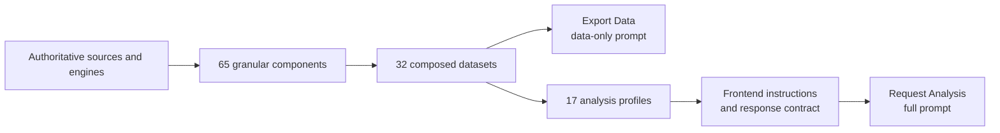
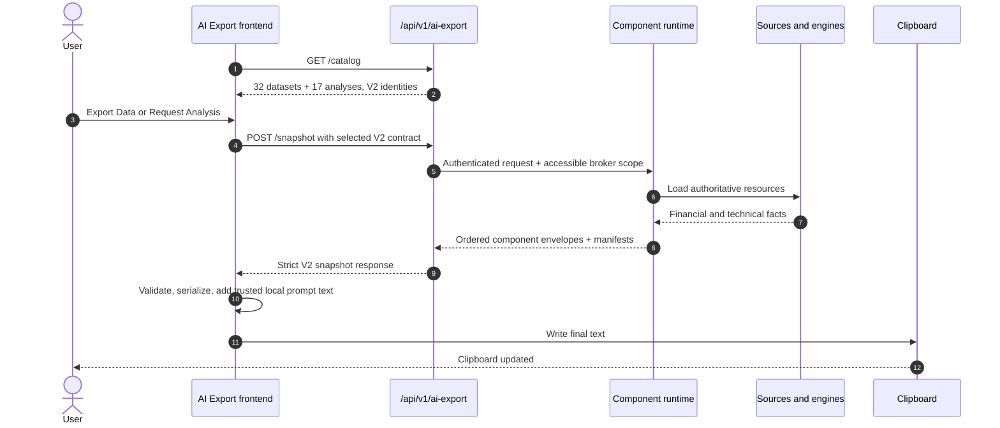

# 🧠 AI Export Component Runtime

AI Export builds an authenticated, factual backend snapshot and lets the frontend
compose a clipboard-ready prompt. LibreFolio does **not** call an LLM, upload the
snapshot, or choose where the user pastes it.

!!! important "Semantic Composition V2 hard cutover"

    AI Export uses schema/catalog/selection contract V2. The frontend and backend
    cut over together and reject V1 identities; there is no compatibility fallback,
    parallel payload, or legacy runtime.

## 🧱 Runtime Catalog

The component runtime contains:

| Domain | Components | Datasets | Analyses | Page |
|---|---:|---:|---:|---|
| Portfolio | 21 | 10 | 7 | Dashboard |
| Broker | 18 | 10 | 4 | Broker |
| Asset | 14 | 6 | 2 | Asset |
| FX | 12 | 6 | 3 | FX |
| **Total** | **65** | **32** | **16** | |

Components are the smallest buildable facts. Datasets compose components. Analyses
compose datasets and pair them with frontend-owned instructions and response
contracts. The catalog and selection contract remain V2 in place: adequacy
evidence was added by extending the same registries with new component, dataset,
and analysis identities, never by forking a parallel schema.



See [Composition & Prompt](ai_export_composition.md) for dependency, ordering, and
failure semantics.

## 🔄 Request Flow



The backend builds one request-scoped `BuildContext`. Shared DB reports, prices,
rates, FIFO results, signal results, and component envelopes are memoized so
overlapping datasets do not repeat work.

## 🧭 Ownership Boundary

| Backend owns factual meaning | Frontend owns presentation |
|---|---|
| Authentication and broker authorization | Localized labels and descriptions |
| Component, dataset, and analysis registries | Analysis instructions |
| Portfolio Engine, FIFO, FX, provider, and Signal Plugin facts | Response contracts |
| Required/optional composition and applicability | User notes and response language |
| Sampling and event-selection policies | Safe YAML/Markdown serialization |
| Focused technical projection selection | Localized Additional Data guidance |
| FX requested/available history coverage | A#/B#/F# public reference rendering |
| Dataset, technical-sampling, and event-selection manifests | Clipboard transport |
| Typed failure semantics | Prompt-size display |

Frontend code must not recalculate portfolio metrics, FIFO, FX conversions,
indicators, states, events, sampling, or event selection.

## 🏦 Broker Scope Semantics

Portfolio snapshots distinguish three Broker universes:

| Public field | Meaning |
|---|---|
| `scoped_broker_count` | Brokers selected for the calculation after access validation. |
| `position_broker_count` | Brokers with current open positions at `snapshot_as_of`. |
| `period_contributor_broker_count` | Brokers represented by period performance contributors. |
| `broker_scope` | The scoped universe rendered as B# references. |

A scoped Broker may have no current position. A period contributor may be
historical-only. The Entity Directory includes every scoped Broker, including
all-accessible requests that did not send an explicit Broker filter.

## 🔐 Authentication and Failures

`GET /api/v1/ai-export/catalog` is static and user-data-free.
`POST /api/v1/ai-export/snapshot` is authenticated and read-only.

| HTTP | Code | Meaning |
|---:|---|---|
| `403` | `broker_access_denied` | Requested broker scope is not fully accessible. |
| `404` | `entity_not_found` | Requested Asset, Broker, or other target does not exist. |
| `409` | `version_mismatch` | Catalog, selection, instruction, or response-contract identity differs. |
| `422` | `unsupported_selection` | Dataset or analysis is unknown or belongs to another domain. |
| `422` | `selection_not_applicable` | Runtime facts do not satisfy an analysis applicability rule. |
| `503` | `snapshot_source_failure` | A required component raised while building. |

Required failures fail closed. Optional failures may be omitted and remain
internally diagnosed. A successfully built empty payload is valid data, not a
source failure.

## 📦 Completeness and Size

AI Export preserves the selected scope and detail level:

- no token- or character-based truncation;
- no segmented or paginated prompt;
- no automatic detail downgrade;
- no asset or indicator removal for size reasons;
- no legacy builder fallback;
- no LLM request.

Technical history uses deterministic density reduction rather than truncation.
Events use deterministic per-annotation selection rather than ranking. See
[Technical Sampling](ai_export_sampling.md).

Backend temporal buckets remain available for calculation and diagnostics. The
public renderer omits only rows that contain nominal bucket boundaries and no
observation, economic value, flow, P&L, extrema, reconciliation, meaningful date,
or explicit non-absence state. Observed zero values remain public. Requested,
effective, and available periods plus coverage/warnings remain visible.

Non-technical analyses do not consume the complete technical dataset by default.
They use backend-owned focused datasets containing coverage, current/summary
states, comparable returns, limited task-specific history, and restricted
structural events. Complete technical Export Data and explicitly technical
analyses remain unchanged. The `technical_breadth` analysis reads only the
aggregate `portfolio.technical_summary`; the complete `portfolio.technical`
series stays intact and is offered as recommended Additional Data.

Task-specific analyses also carry dedicated deterministic evidence: dated income
history (`portfolio.income_evidence`), broker concentration
(`broker.concentration_evidence`), broker cost/turnover
(`broker.cost_efficiency_evidence`), non-predictive FX conversion timing
(`fx.conversion_timing_context`), and optional peak-relative drawdown context
(`*.drawdown_context`). PAC Planning additionally receives a compact per-Asset
observed-price Drawdown comparison without exporting Drawdown history. These reuse
the authoritative engines and never invent, forecast, or re-derive their figures.

FX snapshots may succeed with partial source history. The response keeps the
requested period and separately reports the available period, calendar-day
coverage, observed/backfilled counts, and `insufficient_source_history` warning.
A snapshot still fails when no rate exists on or before the snapshot date. FX
conversion-timing evidence frames the current rate against the observed period
minimum/maximum as a plain range position, never a percentile and never a
forecast.

## 🗺️ Main Files

```text
backend/app/
├── api/v1/ai_export.py
├── schemas/ai_export_runtime.py
└── services/ai_export/
    ├── components/
    ├── datasets/{spec,catalog}.py
    ├── analyses/{spec,catalog}.py
    ├── dependencies.py
    ├── composer.py
    ├── runtime_service.py
    └── temporal/

frontend/src/lib/features/ai-export/
├── AiExportMenu.svelte
├── AiExportOptionsPanel.svelte
├── catalog/
├── templates/
├── serialization/
├── aiExportClient.ts
├── aiExportClipboard.ts
├── aiExportMemory.ts
├── aiExportOptions.ts
└── ui.ts

backend/test_scripts/diagnostics/
├── ai_export_probe_app.py
└── ai_export_real_prompt_probe.py

frontend/scripts/
├── ai-export-render-prompt-probe.ts
└── run-ai-export-render-prompt-probe.mjs
```

## 🔗 Related Documentation

- [Composition & Prompt](ai_export_composition.md)
- [Technical Sampling](ai_export_sampling.md)
- [Probe Workflow & Review](ai_export_probe_workflow.md)
- [Signal Plugin Guide](signal_plugin_guide.md)
- [Registry Pattern Overview](registry_pattern.md)
