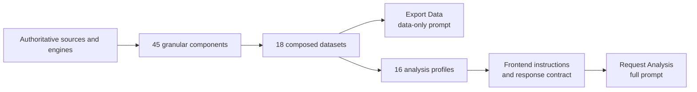
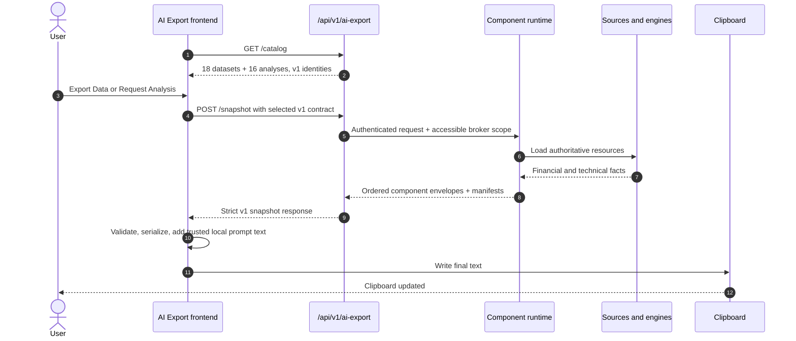

# 🧠 AI Export Component Runtime

AI Export builds an authenticated, factual backend snapshot and lets the frontend
compose a clipboard-ready prompt. LibreFolio does **not** call an LLM, upload the
snapshot, or choose where the user pastes it.

!!! important "Beta contract: migrate v1 in place"

    AI Export remains beta. Component, dataset, analysis, sampling, manifest, and
    response contracts migrate in place as version 1. There is no legacy runtime,
    compatibility fallback, parallel payload, or version bump for this refinement.

## 🧱 Runtime Catalog

The component runtime contains:

| Domain | Components | Datasets | Analyses | Page |
|---|---:|---:|---:|---|
| Portfolio | 14 | 5 | 7 | Dashboard |
| Broker | 11 | 5 | 4 | Broker |
| Asset | 11 | 4 | 2 | Asset |
| FX | 9 | 4 | 3 | FX |
| **Total** | **45** | **18** | **16** | |

Components are the smallest buildable facts. Datasets compose components. Analyses
compose datasets and pair them with frontend-owned instructions and response
contracts.



See [Composition & Prompt](ai_export_composition.md) for dependency, ordering, and
failure semantics.

## 🔄 Request Flow



The backend builds one request-scoped `BuildContext`. Shared DB reports, prices,
rates, FIFO results, signal results, and component envelopes are memoized so
overlapping datasets do not repeat work.

## 🧭 Ownership Boundary

| Backend owns factual meaning | Frontend owns presentation |
|---|---|
| Authentication and broker authorization | Localized labels and descriptions |
| Component, dataset, and analysis registries | Analysis instructions |
| Portfolio Engine, FIFO, FX, provider, and Signal Plugin facts | Response contracts |
| Required/optional composition and applicability | User notes and response language |
| Sampling and event-selection policies | Safe YAML/Markdown serialization |
| Dataset, technical-sampling, and event-selection manifests | Clipboard transport |
| Typed failure semantics | Prompt-size display |

Frontend code must not recalculate portfolio metrics, FIFO, FX conversions,
indicators, states, events, sampling, or event selection.

## 🔐 Authentication and Failures

`GET /api/v1/ai-export/catalog` is static and user-data-free.
`POST /api/v1/ai-export/snapshot` is authenticated and read-only.

| HTTP | Code | Meaning |
|---:|---|---|
| `403` | `broker_access_denied` | Requested broker scope is not fully accessible. |
| `404` | `entity_not_found` | Requested Asset, Broker, or other target does not exist. |
| `409` | `version_mismatch` | Catalog, selection, instruction, or response-contract identity differs. |
| `422` | `unsupported_selection` | Dataset or analysis is unknown or belongs to another domain. |
| `422` | `selection_not_applicable` | Runtime facts do not satisfy an analysis applicability rule. |
| `503` | `snapshot_source_failure` | A required component raised while building. |

Required failures fail closed. Optional failures may be omitted and remain
internally diagnosed. A successfully built empty payload is valid data, not a
source failure.

## 📦 Completeness and Size

AI Export preserves the selected scope and detail level:

- no token- or character-based truncation;
- no segmented or paginated prompt;
- no automatic detail downgrade;
- no asset or indicator removal for size reasons;
- no legacy builder fallback;
- no LLM request.

Technical history uses deterministic density reduction rather than truncation.
Events use deterministic per-annotation selection rather than ranking. See
[Technical Sampling](ai_export_sampling.md).

## 🗺️ Main Files

```text
backend/app/
├── api/v1/ai_export.py
├── schemas/ai_export_runtime.py
└── services/ai_export/
    ├── components/
    ├── datasets/{spec,catalog}.py
    ├── analyses/{spec,catalog}.py
    ├── dependencies.py
    ├── composer.py
    ├── runtime_service.py
    └── temporal/

frontend/src/lib/features/ai-export/
├── catalog/
├── templates/
├── serialization/
├── aiExportClient.ts
└── aiExportClipboard.ts
```

## 🔗 Related Documentation

- [Composition & Prompt](ai_export_composition.md)
- [Technical Sampling](ai_export_sampling.md)
- [Signal Plugin Guide](signal_plugin_guide.md)
- [Registry Pattern Overview](registry_pattern.md)
