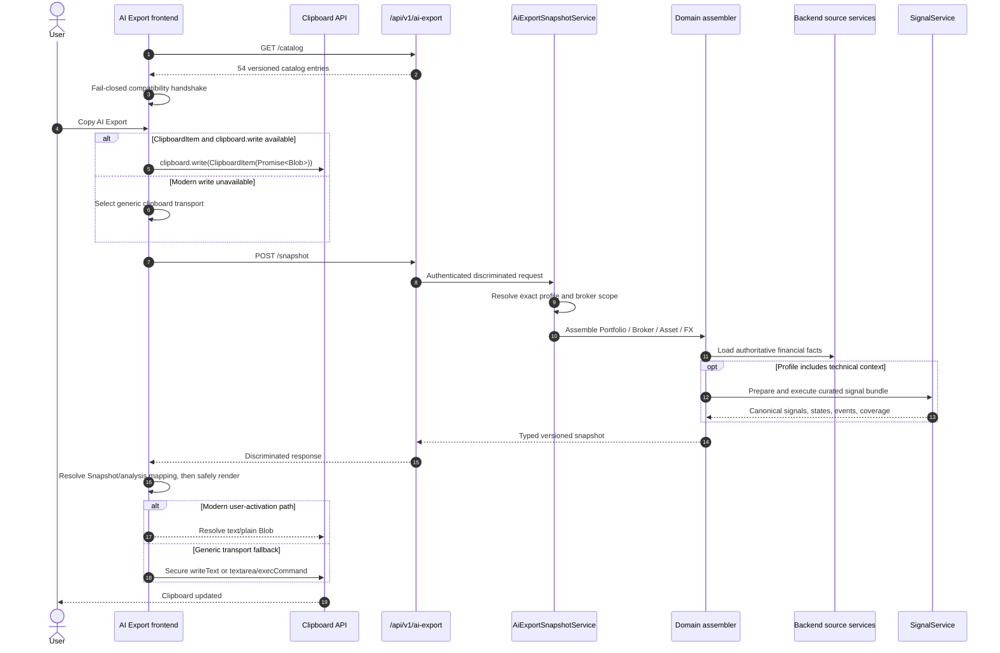

# 🧠 AI Export Snapshot Architecture

AI Export V2 creates a versioned, typed snapshot of LibreFolio data and copies a
locally rendered YAML/Markdown export to the browser clipboard.

!!! important "No AI service is called"

    LibreFolio does not send the snapshot to an LLM. The backend returns factual
    data only; the frontend renders clipboard text, and the user decides where to
    paste it.

## 🔄 End-to-End Flow



When `ClipboardItem` and `clipboard.write()` exist, clipboard activation starts
before the network promise settles. This keeps the modern write inside the
originating user gesture while the snapshot is assembled.

If that modern path is unavailable, the frontend prepares the V2 export exactly
once, then writes the same final prompt through the generic clipboard transport:
secure-context `writeText()` first, textarea/`execCommand("copy")` otherwise.
Transport fallback never invokes legacy export builders, serializers, or
financial logic. If every transport fails, the frontend surfaces the typed
clipboard error.

## 🔌 HTTP and Type Contracts

### 📚 Catalog Endpoint

`GET /api/v1/ai-export/catalog` returns static, user-data-free compatibility
metadata:

- catalog schema version;
- domain, task, and detail level;
- profile ID and version;
- frontend response-contract ID and version;
- applicability code;
- support flags for user notes and web research.

The catalog contains no labels, prompt text, or instructions. Presentation stays
frontend-owned.

### 📸 Snapshot Endpoint

`POST /api/v1/ai-export/snapshot` is authenticated and read-only. Every request
contains:

- `domain`, `task`, and `detail_level`;
- inclusive `date_range`;
- `target_currency`;
- a domain discriminator: portfolio scope, `broker_id`, `asset_id`, or canonical
  FX base/quote currencies.

Requests and responses are strict Pydantic discriminated unions keyed by
`domain`; unknown fields are forbidden. Responses share versioned metadata,
methodology, coverage, metric/signal semantics, notes, and export statistics,
then expose domain-specific `facts`.

### 🚨 Typed Problems

| HTTP  | Problem code              | Meaning                                                                  |
| ----- | ------------------------- | ------------------------------------------------------------------------ |
| `403` | `broker_access_denied`    | At least one requested broker is outside the authenticated user's scope. |
| `404` | `entity_not_found`        | The requested broker, asset, or other target is unavailable.             |
| `409` | `task_not_applicable`     | The target lacks facts required for that task.                           |
| `422` | `unsupported_profile`     | The exact domain/task/detail tuple is not allow-listed.                  |
| `503` | `snapshot_source_failure` | A required backend source failed or returned unusable data.              |

The frontend also raises typed validation, network, catalog, and
profile/response-contract mismatch errors.

## 🖥️ Frontend Panel Boundary

The panel presents a synthetic **Data Snapshot** choice before the real analysis
tasks. This is a UI mapping only; it does not change the backend catalog, profile
matrix, or API:

| Surface | Snapshot backend task |
| ------- | --------------------- |
| Dashboard | `portfolio_description` |
| Asset Detail | `asset_snapshot` |
| FX Detail | `fx_trend_review` |
| Broker Detail | `broker_review` |

Snapshot always renders `data_only`, with no task instructions or response
contract, and hides response language and user notes. Switching back to an
analysis restores those draft values. Every real analysis task always renders
`full_prompt`, so its local task instructions and response contract are included
automatically.

The backend catalog keeps `supports_web_research` compatibility metadata for
internal/backward-compatible rendering paths, but this panel exposes no web
research control and always passes `webResearch: false`.

Panel dirty state compares normalized effective task, detail, render mode,
language, notes, and forced-false web research against the values captured when
the panel opened. Outside click, Escape, and trigger-close requests use the
shared discard `ConfirmModal`; a successful export commits and closes directly.

## 🗂️ Curated Profile Catalog

The allow-list is the Cartesian product of **18 frozen tasks** and the three
detail overlays `compact`, `standard`, and `full`: **54 profiles**.

| Domain    | Tasks                                                                                                                        | Count |
| --------- | ---------------------------------------------------------------------------------------------------------------------------- | ----: |
| Portfolio | recurring investment planning, rebalancing, performance attribution, income review, technical breadth, portfolio description |     6 |
| Asset     | snapshot, trend analysis, position review, recurring investment timing, drawdown and recovery                                |     5 |
| FX        | trend review, exposure impact, conversion timing context                                                                     |     3 |
| Broker    | review, cost efficiency, concentration context, FIFO lot review                                                              |     4 |

`resolve_profile()` performs an exact lookup. It does not normalize unsupported
values, choose defaults, auto-enrol signal plugins, or fall back to another
profile.

Detail overlays control cardinality, sampling, precision, and event limits:

- **Compact** keeps complete aggregates but applies an explicit, reported entity
  selection and omits time series.
- **Standard** includes all applicable entities plus bounded daily/weekly
  samples.
- **Full** includes all applicable entities and weekly samples across the full
  technical window.

## 🏗️ Backend Assembly Boundary

`AiExportSnapshotService` is independent of FastAPI. It resolves the profile,
loads the user's accessible broker IDs in one query, rejects any denied explicit
scope, and dispatches to one assembler:

- `AiExportPortfolioAssembler`;
- `AiExportBrokerAssembler`;
- `AiExportAssetAssembler`;
- `AiExportFxAssembler`.

Assemblers map existing authoritative services instead of reimplementing their
math:

| Source seam                                       | AI Export use                                                                                       |
| ------------------------------------------------- | --------------------------------------------------------------------------------------------------- |
| `PortfolioService` / `PortfolioCalculationEngine` | NAV, holdings, WAC-based cost and P&L, contributions, allocations, history, and cash decomposition. |
| `LotsAnalysisService`                             | Runtime FIFO lot summaries for Asset and Broker tasks.                                              |
| `AssetSourceManager` and Asset metadata           | Bulk prices/events, identity, classification, and valuation context.                                |
| FX `convert_bulk`                                 | Historical pair observations and snapshot-date currency conversion.                                 |
| `SignalService`                                   | Plugin planning, warm-up, coverage, calculation, canonical outputs, states, and annotations.        |

Source failures are translated into stable typed problems; assemblers do not
silently invent missing facts.

## 📐 Financial Semantics

### 📈 Normalized Return and Valuation

Normalized return uses observed market data only:

1. choose the first observed point **on or after** the requested start;
2. record whether the base is the exact start or the first observation in the
   window;
3. compute returns from that unsampled base;
4. sample only afterward while preserving both the base and latest point.

Backward-filled observations do not become market-return bases. Young assets can
therefore report an incomplete window explicitly.

Position valuation follows the Portfolio Engine hierarchy:

`MARKET_PRICE → LAST_BUY_PRICE → LAST_SEED_COST → MISSING`

The snapshot contract maps `LAST_BUY_PRICE` to the more explicit
`LAST_VISIBLE_BUY_UNIT_PRICE` label.

Last-BUY and seed-cost references may be split-adjusted, but they are valuation
fallbacks, never observed market returns. Asset facts cannot expose a normalized
return and a fallback valuation reference for the same snapshot.

### 💶 Portfolio Cash Denominators

!!! important "Two factual views, two denominators"

    Portfolio summary cash and `cash_context` come from Portfolio
    Engine/Service history. They preserve the engine's transaction-date FX
    economics and its split between contributed capital and generated returns.

    Currency exposure is different: native cash balances are converted at
    `snapshot_as_of`, then combined with positions grouped by trading currency.
    `allocation_by_currency_pct` therefore declares and uses its own denominator,
    `trading_currency_positions_plus_native_cash_snapshot_value`, rather than
    portfolio NAV.

Keeping those bases separate prevents a snapshot-date exposure view from
rewriting engine-owned portfolio accounting.

### 💱 FX Exposure

FX exposure is deliberately not look-through. It includes only:

- native cash whose currency is one side of the pair;
- positions whose trading currency or authoritative valuation currency is one
  side of the pair.

Fund constituents, issuer revenue currencies, and other inferred underlying
exposures are outside this contract.

## 📊 Shared Signal Path

AI Export does not calculate EMA, RSI, MACD, Bollinger Bands, or any other
indicator in TypeScript. An assembler converts bulk-loaded Asset or FX data into
neutral signal points, asks the shared `SignalService` to prepare and execute the
profile's curated bundle, and maps canonical results into snapshot technical
facts.

Chart APIs and AI Export therefore have different adapters but the same plugin
runtime and numerical truth. See the
[Signal Plugin Guide](signal_plugin_guide.md) for plugin contracts, styles,
coverage, warm-up, and annotations.

## 🖥️ Frontend Boundary

The frontend owns only presentation and clipboard concerns:

- local task labels and descriptions;
- local instruction templates and response contracts;
- response language, optional user notes, and the web-research instruction;
- `data_only` versus `full_prompt` rendering;
- deterministic prompt-size reporting;
- safe YAML and Markdown serialization.

Snapshot values and user notes are serialized as data inside dynamically sized
fenced blocks. They are never inserted as raw Markdown instructions. Only trusted
local template text and allow-listed response-language display names are
interpolated directly.

The compatibility handshake fails closed if the catalog schema, profile ID or
version, support flags, response contract, snapshot schema, domain, task, detail,
scope, or target identity does not match. Incompatible choices are disabled;
there is no legacy runtime fallback or feature flag.

## ✂️ Hard Cutover

Production routes use only AI Export V2. The former Portfolio/Asset/FX builders,
domain clipboard modules, custom YAML serializer, prompt renderers, allocation
compaction, and frontend technical-event calculation were removed. Legacy data
survives only as versioned parity fixtures.

The local TypeScript EMA, RSI, MACD, and Bollinger engines were also removed.
Frontend-local comparisons, synthetic benchmarks, `MeasureSignal`, catalog
mapping, and generic backend result rendering remain supported.

## 🗺️ File Map

```text
backend/app/
├── api/v1/ai_export.py
├── schemas/ai_export.py
└── services/ai_export/
    ├── models.py, resolver.py, service.py
    ├── normalization.py, sampling.py, coverage.py, telemetry.py
    ├── technical.py
    ├── profiles/{base,portfolio,asset,fx,broker}.py
    └── assemblers/{shared,portfolio,asset,fx,broker}.py

frontend/src/lib/features/ai-export/
├── AiExportMenuV2.svelte
├── AiExportOptionsPanel.svelte
├── aiExportClient.ts, aiExportClipboardV2.ts, aiExportOptions.ts, ui.ts
├── catalog/{shared,compatibility,portfolioTasks,assetTasks,fxTasks,brokerTasks}.ts
├── templates/{sharedInstructions,responseContracts,promptRenderer}.ts
├── serialization/{yaml,markdown}.ts
└── __tests__/
```

Route integration lives in Dashboard, Broker Detail, Asset Detail, and FX Detail.
Backend tests live under `backend/test_scripts/test_{schemas,services,api}/`;
cross-domain browser coverage lives in `frontend/e2e/ai-export.spec.ts`.

## ➕ Extension Checklist

Adding or changing a task requires one coordinated contract change:

1. add or update the backend task enum, `TaskSpec`, profile sections,
   applicability, compact selection, and technical bundles;
2. update strict schemas, assembler output, typed errors, and backend tests;
3. regenerate the API client with `./dev.py api sync`;
4. add the frontend catalog definition;
5. add its local instruction template and response contract;
6. add EN/IT/FR/ES labels, descriptions, and error text where needed;
7. add catalog-handshake, client, renderer, serialization, clipboard, UI, and E2E
   tests;
8. update this page and the relevant user documentation.

Never ship a backend-only or frontend-only task: the catalog handshake will
disable an incomplete contract.

## ✅ Validation Commands

```bash
./dev.py api sync
./dev.py test schemas all
./dev.py test services all
./dev.py test api all
./dev.py test front-ai-export all
./dev.py front check
./dev.py front build
./dev.py i18n audit
./dev.py mkdocs build
./dev.py mkdocs check-links
./dev.py mkdocs translate-validate
```

## 🔗 Related Documentation

- [AI Export User Guide](../../../user/ai-export/index.md)
- [Signal Plugin Guide](signal_plugin_guide.md)
- [Registry Pattern Overview](registry_pattern.md)
