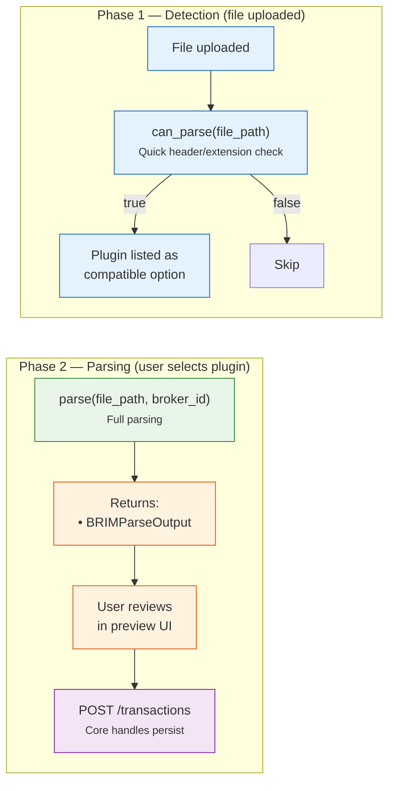

# 📦 BRIM Plugin Guide

How to create a new **Broker Report Import Manager** plugin to support a new broker's CSV/Excel export format.

**Base class**: `BRIMProvider` (in `backend/app/services/brim_provider.py`)
**Plugin folder**: `backend/app/services/brim_providers/`
**Registry**: `BRIMProviderRegistry`

---

## 🤖 Tip: Let an LLM write the plugin for you

Paste this entire page plus the [Generic CSV Provider](../../backend/brim/generic_csv.md) page into an LLM and use this prompt:

!!! tip "Suggested prompt"

    ```
    Here is the LibreFolio BRIM plugin specification: [paste this page]
    Here is the Generic CSV reference implementation: [paste generic_csv page]

    I have a broker called [BROKER_NAME]. Here is a sample of their CSV export: [paste header + 3–5 rows]

    Write a complete Python BRIMProvider plugin for this broker. Follow the conventions
    exactly (BRIMParseOutput, BRIMExtractedAssetInfo, sign conventions, @register_provider).
    ```

    The LLM will produce a complete, working plugin skeleton. Test it with the probe endpoint,
    then add it to `brim_providers/` and restart — it will be auto-discovered.

---

## 🔄 Flow

The system calls plugin methods in two distinct phases:



**Phase 1** runs automatically when a file is uploaded — every registered plugin is asked if it can parse the file. Compatible plugins are listed for the user.

**Phase 2** runs when the user selects a specific plugin — the plugin parses the file, the user reviews the results, and confirms the import.

**Plugin responsibility**: Read the broker-specific file format and convert to standard `TXCreateItem` DTOs.
**Core responsibility**: File storage, asset matching, duplicate detection, database persistence.

---

## 📋 ABC Methods

### ✅ Required (Abstract)

| Method | Signature | Description |
|--------|-----------|-------------|
| `provider_code` | `@property → str` | Unique identifier (e.g., `"directa_csv"`) |
| `provider_name` | `@property → str` | Display name (e.g., `"Directa CSV"`) |
| `description` | `@property → str` | Brief description for the UI |
| `can_parse(file_path)` | `→ bool` | Quick check if this plugin can parse the file (check extension, header row) |
| `parse(file_path, broker_id)` | `→ BRIMParseOutput` | Full parsing — returns structured BRIMParseOutput object containing transactions, warnings, and extracted asset info |

### 🔧 Optional (Override)

| Method | Default | Description |
|--------|---------|-------------|
| `supported_extensions` | `['.csv']` | Accepted file extensions |
| `detection_priority` | `100` | Auto-detection priority (higher = checked first). Use 0-49 for generic plugins. |
| `icon_url` | `None` | Broker favicon URL for the UI (see [Favicons](#favicons)) |
| `docs_url` | `None` | Link to a user-facing MkDocs page. Leave `None` if no page exists (avoids dead links). |
| `plugin_version` | `"1.0.0"` | Semver of the parsing logic — **bump it** whenever output for the same input changes |
| `test_file_pattern` | `None` | Single filename substring used by the test suite to map a sample → this plugin |
| `test_file_patterns` | derived from `test_file_pattern` | **List** of filename substrings when one plugin owns several export formats (e.g. `["revolut-invest", "revolut-crypto"]`) |
| `generate_static_url(path)` | — | Helper to build `/api/v1/uploads/plugin/brim/{path}` |

### 🧰 Base-class helpers you should use

Defined on `BRIMProvider` — call these instead of re-implementing:

| Helper | Use it in | What it does |
|--------|-----------|--------------|
| `self._read_file_head(file_path, num_lines=15)` | `can_parse` | Reads the first N lines trying multiple encodings (utf-8-sig, utf-8, latin-1, cp1252) |
| `self.detect_csv_delimiter(file_path)` | `parse` | Sniffs the delimiter (`,` `;` `\t`) via `csv.Sniffer` with a char-count fallback |
| `self._create_transaction(row_num, transactions, validation_issues, context, **tx_fields)` | `parse` | Builds a `TXCreateItem`, appends on success, or records structured `BRIMValidationIssue`s on `ValidationError`. **Never** call `TXCreateItem(...)` directly. |

---

## 💻 Implementation Example

```python
# backend/app/services/brim_providers/my_broker.py

from pathlib import Path
from backend.app.services.brim_provider import BRIMProvider
from backend.app.services.provider_registry import register_provider, BRIMProviderRegistry
from backend.app.schemas.brim import BRIMExtractedAssetInfo, BRIMParseOutput
from backend.app.schemas.transactions import TXCreateItem

@register_provider(BRIMProviderRegistry)
class MyBrokerProvider(BRIMProvider):

    @property
    def provider_code(self) -> str:
        return "my_broker_csv"

    @property
    def provider_name(self) -> str:
        return "My Broker (CSV)"

    @property
    def description(self) -> str:
        return "Import transactions from My Broker CSV exports"

    def can_parse(self, file_path: Path) -> bool:
        """Quick check: read first lines and look for known header."""
        content = self._read_file_head(file_path, num_lines=5)
        return "Date;Operation;ISIN;Amount" in content

    def parse(self, file_path: Path, broker_id: int) -> BRIMParseOutput:
        """Parse the CSV and return transactions in a BRIMParseOutput envelope."""
        transactions = []
        warnings = []
        extracted_assets = {}

        # ... your parsing logic ...

        return BRIMParseOutput(
            transactions=transactions,
            warnings=warnings,
            extracted_assets={
                fake_id: BRIMExtractedAssetInfo(
                    extracted_symbol=info["extracted_symbol"],
                    extracted_isin=info["extracted_isin"],
                    extracted_name=info["extracted_name"],
                )
                for fake_id, info in extracted_assets.items()
            }
        )
```

### 🔍 Auto-Discovery

Place the file in `brim_providers/` and restart the app. The `BRIMProviderRegistry` will automatically discover and register it. The plugin will appear in the [ImportPluginSelect](../../frontend/components/core-ui/select.md#importpluginselect) dropdown.

---

## 🧭 Real-world reference plugins

Copy the structure of an existing, well-tested plugin rather than starting from scratch:

| File | Best example of |
|------|-----------------|
| `backend/app/services/brim_providers/broker_directa.py` | Equity/ETF, index-based columns, Italian types, ISIN grouping, tax/fee linking |
| `backend/app/services/brim_providers/broker_generic_csv.py` | Column auto-detection, locale-aware number parsing |
| `backend/app/services/brim_providers/broker_coinbase.py` | Crypto assets (symbol, no ISIN), staking as `ADJUSTMENT`, separate fee tx |
| `backend/app/services/brim_providers/broker_revolut.py` | **One plugin, two formats** (invest + crypto) via header detection |
| `backend/app/services/brim_providers/broker_saxo.py` | Mixed trade/cash rows, verb-in-text events, localized verbs |

## 📥 Canonical imports

```python
from __future__ import annotations

import csv
from datetime import date as date_type
from datetime import datetime
from decimal import Decimal, InvalidOperation
from pathlib import Path
from typing import Dict, List, Optional

import structlog

from backend.app.db.models import TransactionType
from backend.app.schemas.brim import FAKE_ASSET_ID_BASE, BRIMExtractedAssetInfo, BRIMParseOutput, BRIMValidationIssue
from backend.app.schemas.common import Currency
from backend.app.schemas.transactions import TXCreateItem
from backend.app.services.brim_provider import BRIMParseError, BRIMProvider
from backend.app.services.provider_registry import BRIMProviderRegistry, register_provider

logger = structlog.get_logger(__name__)
```

## ➕➖ Sign conventions (enforced by the test suite)

`TransactionType` (in `backend/app/db/models.py`) fixes the sign of `quantity` and cash
`amount`. `test_all_transactions_are_schema_valid` fails the plugin if any emitted
transaction breaks these rules, so flip source signs as needed:

| Type | quantity | cash amount | asset |
|------|----------|-------------|-------|
| `BUY` | `> 0` | `< 0` | required |
| `SELL` | `< 0` | `> 0` | required |
| `DIVIDEND` | `= 0` | `> 0` | required |
| `INTEREST` | `= 0` | `> 0` | optional |
| `DEPOSIT` | `= 0` | `> 0` | none |
| `WITHDRAWAL` | `= 0` | `< 0` | none |
| `FEE` | `= 0` | `< 0` | optional |
| `TAX` | `= 0` | `< 0` | optional |
| `ADJUSTMENT` / `TRANSFER` | `+/-` | **must be `None`** | optional |

- `DIVIDEND`/`INTEREST` carry **no** quantity — set `quantity=0` and discard any token
  amount with a warning (see coinbase).
- **Crypto — the fiat leg decides the type.** If a row settles in **fiat** (your account
  currency) use a cash type: buy crypto with fiat → `BUY`, sell for fiat → `SELL`, a reward
  paid out in fiat → `INTEREST`, a stock payout → `DIVIDEND`, plain cash in/out →
  `DEPOSIT`/`WITHDRAWAL`. If a row has **no fiat leg** — staking/airdrop paid in coins, a
  crypto↔crypto trade, an on-chain transfer in/out, or a crypto-denominated fee — model it as
  a **cashless `ADJUSTMENT`** (`quantity` +/-, `cash=None`) so the position still updates.
  This is what keeps every crypto row schema-valid, because `ADJUSTMENT` forbids a cash
  amount. Reference: `broker_bitvavo.py`, `broker_cointracking.py`, `broker_delta.py`,
  `broker_cryptocom.py` (note `cryptocom` emits `INTEREST` for fiat-valued rewards but a
  cashless `ADJUSTMENT` for coin-only rewards).
- Prefer **skipping a row with a warning** over emitting a schema-invalid transaction.

## 🆔 Fake asset IDs

Asset-linked transactions reference a *fake* (negative) asset id at parse time; the core
maps it to a real asset later. Allocate them yourself, grouping rows of the same asset:

```python
next_fake_id = FAKE_ASSET_ID_BASE          # a large negative sentinel
asset_to_fake_id: dict[str, int] = {}
extracted_assets_raw: dict[int, dict] = {}

asset_key = isin or ticker                 # stable key per asset
if asset_key in asset_to_fake_id:
    asset_id = asset_to_fake_id[asset_key]
else:
    asset_id = next_fake_id
    asset_to_fake_id[asset_key] = asset_id
    extracted_assets_raw[asset_id] = {
        "extracted_symbol": ticker or None,
        "extracted_isin": isin or None,     # None for crypto
        "extracted_name": name or None,
    }
    next_fake_id -= 1
```

Return them as `BRIMExtractedAssetInfo` in `BRIMParseOutput.extracted_assets`. Every
`tx.asset_id` must appear as a key (checked by `test_extracted_assets_consistent_with_transactions`).

## 🔀 One plugin, several export formats

A single broker often ships multiple export layouts (e.g. Revolut *invest* vs *crypto*).
**Do not create two plugins** unless the files are genuinely indistinguishable and the user
must choose. Instead:

1. Make `can_parse` return `True` for **any** owned layout (detect by header).
2. In `parse`, read the header row, pick the variant, and dispatch to a private helper
   (`_parse_invest(...)` / `_parse_crypto(...)`), keeping one `BRIMProvider` class.
3. Register **one sample per variant** in `sample_reports/` and list every filename
   substring in `test_file_patterns`:

```python
@property
def test_file_patterns(self) -> List[str]:
    return ["revolut-invest", "revolut-crypto"]
```

The test suite loops over every matching sample, so each variant is exercised.

## 🧪 Register a sample (required for tests)

The parametrized suite in `backend/test_scripts/test_external/test_brim_providers.py`
auto-covers your plugin — **but only if a sample is present**. Copy one real (anonymized)
export into `backend/app/services/brim_providers/sample_reports/`, with a filename that
contains your `test_file_pattern`/`test_file_patterns` substring:

```bash
cp mybroker-export.csv backend/app/services/brim_providers/sample_reports/mybroker-export.csv
```

Then run just the BRIM suite:

```bash
./dev.py test external brim-providers                       # all plugins
./dev.py test external brim-providers --providers broker_mybroker   # one plugin
```

`test_all_plugins_used_at_least_once` and `test_specific_broker_detection_via_plugin_pattern`
will fail if the sample is missing or if `can_parse` collides with another plugin — keep the
header check specific.

## 🖼️ Favicons

Set `icon_url` to the broker's favicon (`https://<domain>/favicon.ico`). It is rendered both in
the app **Settings → Import** UI and on the mkdocs import page, so it must be embeddable
**cross-origin**. Two failure modes to check for:

- **Cloudflare / bot block** — the domain returns `403`/`404` to non-browser requests but the
  icon still loads in a real browser. `curl -sI` is *not* conclusive here; if it renders in the
  UI, keep it.
- **`cross-origin-resource-policy: same-origin`** — the icon downloads fine with `curl` but the
  browser refuses to embed it from another origin, so it renders **nowhere** in-app (this was
  the Delta case). Check for it:

    ```bash
    curl -sI -L https://<domain>/favicon.ico | grep -i cross-origin-resource-policy
    ```

    If it reports `same-origin`, don't hotlink it — use Google's CORP-free favicon proxy
    (which sends `cross-origin-resource-policy: cross-origin`):

    ```python
    return "https://www.google.com/s2/favicons?domain=<domain>&sz=64"
    ```

    When you place that proxy URL in an HTML `` inside the docs, escape the
    ampersand as `&amp;sz=64`; the raw `&` is fine in the Python `icon_url` string.

If no working icon exists, ship `icon_url = None` and mark the broker in
[Providers List](../../backend/brim/providers_list.md) for a maintainer to fill in.

## 📚 Register the user-facing docs

Expose the plugin to users by wiring up its documentation. Point `docs_url` at the page:

```python
@property
def docs_url(self) -> Optional[str]:
    return "/mkdocs/user/transactions/import/<slug>/"
```

Then, reusing `<slug>` everywhere:

1. **Page (×4 languages)** — create `<slug>.en.md`, `.it.md`, `.fr.md`, `.es.md` in
   `mkdocs_src/docs/user/transactions/import/`. A short beta placeholder is fine (favicon in
   the H1, a "how to export" line, a note that it was built from sample exports). Use
   `directa.it.md` as a fuller reference once real export steps are known.
2. **Index card** — add an `<a href="<slug>/">` card in each
   `mkdocs_src/docs/user/transactions/import/index.<lang>.md` (before the `generic-csv` card).
3. **Capacity table** — add one row per language in the `??? info` table of those same index
   files, **4-space indented** so it stays inside the admonition.
4. **Nav** — add `- <Display>: user/transactions/import/<slug>.md` in `mkdocs_src/mkdocs.yml`
   under the right `📥 Import from Broker` subgroup, and add any new group/leaf title to the
   `nav_translations` of each non-English locale.
5. **Validate** — `./dev.py mkdocs build` must report **no** `unrecognized relative link` /
   `no such anchor`. Internal links use the `.md` form (`how-to.md`,
   `../../../community/contribute.md`), never trailing-slash paths.

---

## 🔗 Related Documentation

- [BRIM Architecture](../../backend/brim/architecture.md) — Full pipeline design
- [Generic CSV Provider](../../backend/brim/generic_csv.md) — User-configurable CSV mapper (reference implementation)
- [Providers List](../../backend/brim/providers_list.md) — All supported brokers
- [Registry Pattern Overview](registry_pattern.md) — How the plugin system works

