# 📊 Signal Plugin Guide

How to add a backend technical indicator to LibreFolio's schema-driven signal system.

**Base class**: `SignalPlugin`  
**Plugin folder**: `backend/app/services/signal_plugins/`  
**Registry**: `SignalPluginRegistry`  
**Orchestrator**: `SignalService`

---

## 🏗️ Architecture

Signal plugins own indicator-specific behavior. Shared infrastructure owns data loading,
coverage policy, error isolation, annotations, and API serialization.

```mermaid
flowchart LR
    API["🌐 Asset / FX API"] --> PLAN["🧭 SignalService.prepare_plan()"]
    PLAN --> LOAD["📚 Domain adapter loads extended data"]
    LOAD --> POINTS["🔄 SignalPricePoint / SignalEventPoint"]
    POINTS --> EXEC["🧠 SignalService.execute()"]
    EXEC --> REG["🧩 SignalPluginRegistry"]
    REG --> PLUGIN["📈 plugin.compute()"]
    PLUGIN --> VALIDATE["🛡️ Contract validation + status"]
    VALIDATE --> ANNOTATE["🎯 SignalAnnotationService"]
    ANNOTATE --> RESULT["📦 Canonical SignalResult"]
```



| Component | Responsibility |
|---|---|
| `signal_runtime.py` | Verify the locked `pandas-ta-classic` + TA-Lib stack at startup and reject silent fallback. |
| `signal_plugins/base.py` | Define the plugin contract and build static catalog metadata. |
| `provider_registry.py` | Discover plugin files, validate definitions, and reject duplicate codes. |
| `signal_service.py` | Plan batches, calculate required history, check coverage, execute plugins, isolate failures, and slice output. |
| `signal_annotations.py` | Derive line crossovers and threshold crossings from extended canonical data. |
| Asset/FX adapters | Load domain data, perform currency conversion, and map it into neutral points. |

!!! important "Plugins do not load data"

    A signal plugin must not access the database, call providers, or know whether it was
    invoked from an Asset or FX endpoint. It receives neutral price/event arrays and
    returns canonical output.

---

## 🔄 Request Lifecycle

### 1. 🧭 Planning

`SignalService.prepare_plan()`:

- resolves each `signal_code` through `SignalPluginRegistry`;
- validates parameters with the plugin-owned Pydantic model;
- deduplicates identical code/parameter combinations while preserving instance IDs;
- asks every plugin for its parameter-aware warm-up requirement;
- aggregates the maximum history and union of required price fields/events;
- records per-instance preflight failures without aborting the remaining batch.

The Asset or FX adapter uses that plan to load one extended input range.

### 2. 🧮 Execution

The complete batch runs inside one `asyncio.to_thread(...)` call. Plugins execute
sequentially, so synchronous numerical libraries never block FastAPI's event loop.

For each plugin, the service:

1. measures field and date coverage;
2. applies the declared gap policy;
3. verifies minimum history and warm-up;
4. calls `plugin.compute(...)`;
5. validates series shape, finite values, declared output keys, axes, and units;
6. slices the extended result to the requested visible range;
7. isolates failures to that signal instance.

### 3. 🎯 Annotations

Optional annotation requests run after indicator calculation against the extended series.
This allows boundary crossovers to be detected correctly before output is sliced.

Supported primitives:

- line/line crossover;
- price/line crossover;
- threshold crossing;
- observed-only filtering;
- event sampling and limits.

Annotations are generic infrastructure, not plugin-specific trading advice.

---

## 📋 Plugin Contract

Every concrete plugin must declare:

| Member | Purpose |
|---|---|
| `signal_code` | Stable uppercase identifier used by APIs and saved settings. |
| `implementation_version` | Version of the plugin's numerical behavior. |
| `category` | Trend, momentum, volatility, or volume. |
| `display_name_key` | Frontend i18n key for the human-readable name. |
| `description_key` | Frontend i18n key for the short selector description. |
| `icon` | Emoji displayed by the signal selector. |
| `docs_path` | MkDocs path opened by the UI information button. |
| `params_model` | Pydantic model with `extra="forbid"` and JSON Schema UI metadata. |
| `input_requirements` | Required OHLCV fields, events, coverage, and data policy. |
| `output_specs` | Declared line/bar/band outputs, units, axes, levels, and regions. |
| `compatible_domains` | `ASSET`, `FX`, or both. |
| `annotation_capabilities` | Supported generic annotation primitives. |
| `warmup_requirement()` | Parameter-aware minimum and stabilization history. |
| `compute()` | Numerical implementation returning `SignalComputation`. |

The base class converts this declaration into `SignalCatalogDefinition`. Therefore the
frontend receives names, descriptions, parameter controls, required data, output shapes,
and documentation links without a signal-specific UI implementation.

---

## 🧱 Status and Data Policy

Each result has an explicit status:

| Status | Meaning |
|---|---|
| `ok` | Complete required input, complete warm-up, and valid visible output. |
| `partial` | Usable output with an explicit warning, such as incomplete stabilization. |
| `unavailable` | Required fields/history are insufficient, so calculation cannot start safely. |
| `failed` | Parameters, computation, output, or contract validation failed. |

The default policy is `STRICT_CONTIGUOUS`: missing required fields or date gaps are never
silently compacted. If a plugin can safely operate on one complete segment, it may declare
`ALLOW_PARTIAL_CONTIGUOUS`. The service prefers the newest segment that satisfies the
plugin's minimum history; otherwise it uses the longest sufficient segment. Output remains
partial and never jumps across the gap.

!!! warning "A long history is not automatically complete"

    An asset can contain decades of closing prices while still lacking `high`, `low`, or
    `volume` on one required date. OHLC/volume plugins will report the exact coverage
    problem instead of computing over silently altered input.

---

## 💻 Complete Example

The example below adds an Asset-only Typical Price line:

$$
TP_t = \frac{H_t + L_t + C_t}{3}
$$

```python
# backend/app/services/signal_plugins/typical_price.py
from collections.abc import Sequence

from pydantic import BaseModel, ConfigDict

from backend.app.schemas.signals import (
    SignalAxisRole,
    SignalAxisSpec,
    SignalCategory,
    SignalComputation,
    SignalDomain,
    SignalEventPoint,
    SignalExecutionContext,
    SignalInputRequirements,
    SignalLineSeries,
    SignalOutputSpec,
    SignalPriceField,
    SignalPricePoint,
    SignalSeriesKind,
    SignalUnit,
    SignalValuePoint,
    SignalViewTransform,
    SignalWarmupRequirement,
)
from backend.app.services.provider_registry import (
    SignalPluginRegistry,
    register_plugin,
)
from backend.app.services.signal_plugins.base import SignalPlugin


class TypicalPriceParams(BaseModel):
    model_config = ConfigDict(extra="forbid")


@register_plugin(SignalPluginRegistry)
class TypicalPriceSignalPlugin(SignalPlugin):
    signal_code = "TYPICAL_PRICE"
    implementation_version = "1.0.0"
    category = SignalCategory.TREND
    display_name_key = "signals.typicalPrice.name"
    description_key = "signals.typicalPrice.description"
    icon = "⚖️"
    docs_path = (
        "financial-theory/technical-analysis/indicators/typical-price/"
    )
    params_model = TypicalPriceParams
    input_requirements = SignalInputRequirements(
        price_fields=[
            SignalPriceField.HIGH,
            SignalPriceField.LOW,
            SignalPriceField.CLOSE,
        ]
    )
    output_specs = (
        SignalOutputSpec(
            key="typical_price",
            label_key="signals.typicalPrice.output",
            kind=SignalSeriesKind.LINE,
            unit=SignalUnit.PRICE,
            axis=SignalAxisSpec(
                key="price",
                role=SignalAxisRole.PRICE,
            ),
            view_transform=SignalViewTransform.BASE_PERCENTAGE,
        ),
    )
    compatible_domains = (SignalDomain.ASSET,)
    annotation_capabilities = ("line_crossover",)

    @classmethod
    def warmup_requirement(
        cls,
        params: TypicalPriceParams,
        context: SignalExecutionContext,
    ) -> SignalWarmupRequirement:
        return SignalWarmupRequirement(
            minimum_points=1,
            stabilization_points=0,
            total_points=1,
        )

    def compute(
        self,
        price_points: Sequence[SignalPricePoint],
        event_points: Sequence[SignalEventPoint],
        params: TypicalPriceParams,
        context: SignalExecutionContext,
    ) -> SignalComputation:
        spec = self.output_specs[0]
        points = []
        for point in price_points:
            if point.high is None or point.low is None or point.close is None:
                raise ValueError("Typical Price requires high, low and close")
            points.append(
                SignalValuePoint(
                    date=point.date,
                    value=(
                        float(point.high)
                        + float(point.low)
                        + float(point.close)
                    )
                    / 3,
                )
            )

        return SignalComputation(
            series=[
                SignalLineSeries(
                    key=spec.key,
                    label_key=spec.label_key,
                    unit=spec.unit,
                    axis=spec.axis.model_copy(deep=True),
                    view_transform=spec.view_transform,
                    points=points,
                )
            ]
        )
```

No central registration list is required. Importing the module triggers
`@register_plugin(SignalPluginRegistry)`.

---

## 🎛️ Parameter Metadata

Parameters are ordinary Pydantic fields. JSON Schema extensions control the generic
frontend form:

```python
period: int = Field(
    20,
    ge=2,
    le=500,
    json_schema_extra={
        "x-i18n-key": "chartSettings.params.period",
        "x-control-order": 1,
        "x-suffix": "days",
        "x-step": 1,
        "x-tooltip-key": "chartSettings.tooltips.period",
    },
)
```

Prefer schema metadata over frontend conditionals. New parameter shapes should be added
to the shared JSON Schema mapper only when they are reusable across plugins.

---

## ✅ Adding a Plugin

1. Create one Python file under `signal_plugins/`.
2. Define a strict Pydantic parameter model.
3. Declare required price fields/events and compatible domains.
4. Declare every canonical output in `output_specs`.
5. Implement parameter-aware `warmup_requirement()`.
6. Implement and normalize `compute()`.
7. Add all EN/IT/FR/ES UI keys.
8. Add the English financial-theory page referenced by `docs_path`.
9. Add focused numerical/parity tests.
10. Update `EXPECTED_CODES` and related expectations in the full plugin matrix.
11. Run the catalog, plugin, service, API, frontend, and documentation gates.

Useful commands:

```bash
./dev.py test services signal-plugin-matrix
./dev.py test services signal-service
./dev.py test api signal-catalogs
./dev.py api sync
./dev.py front check
./dev.py mkdocs build
./dev.py mkdocs check-links
```

---

## 🛡️ Design Rules

- Keep formulas and third-party library selection inside the plugin.
- Keep DB access, provider calls, currency conversion, and HTTP outside the plugin.
- Never compact missing dates or fields silently.
- Return canonical line, bar, or band series only.
- Use finite numeric output; `NaN` may represent warm-up gaps, infinity may not.
- Declare every output key exactly once in `output_specs`.
- Keep plugin construction argument-free and computation deterministic.
- Do not duplicate technical calculations in the frontend.
- Increment `implementation_version` when numerical behavior changes.

---

## 🔗 Related Documentation

- [Registry Pattern Overview](registry_pattern.md)
- [Asset Plugin Guide](asset_plugin_guide.md)
- [FX Plugin Guide](fx_plugin_guide.md)
- [Technical Analysis](../../../financial-theory/technical-analysis/index.md)
