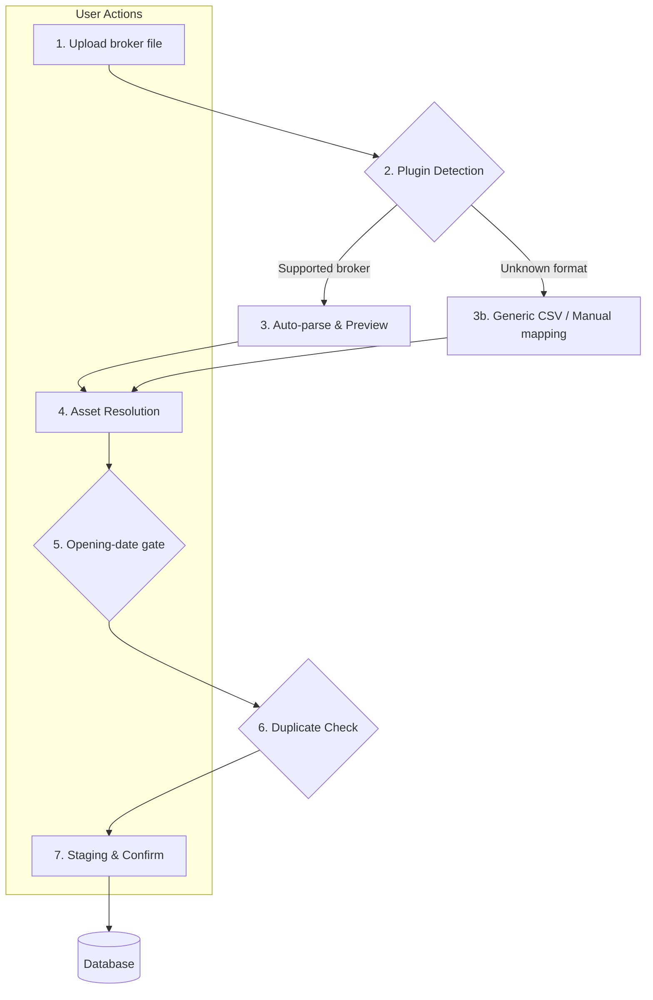

# 📥 BRIM Architecture

**BRIM (Broker Report Import Manager)** is the system responsible for importing transaction data from broker export files (CSV, XLSX, PDF, or another format supported by a plugin). It is designed to be robust, user-friendly, and extensible.

## 🔄 The BRIM Workflow

The import process follows a clear, multi-step wizard designed to give the user full control and visibility.



### 🪜 Step-by-step

1. **Upload** — The user uploads a broker export file. It can be dragged into the broker page or accessed from the Files tab.

2. **Plugin Detection** — BRIM auto-discovers `BRIMProvider` classes from `backend/app/services/brim_providers/`, sorts compatible plugins by `detection_priority` (highest first), and selects the first plugin whose `can_parse(file_path)` returns `True`. If no specific plugin matches, the Generic CSV provider is used as fallback.

3. **Parse & Preview** — The selected plugin's `parse()` method returns a `BRIMParseOutput` containing standardized `TXCreateItem` objects, warnings, extracted assets, optional field TODOs, and optional per-asset notices. **Nothing is saved yet.** The user sees a table of parsed transactions before proceeding.

4. **Asset Resolution** — New or unrecognized assets are shown with a resolution dialog. The user can:
   - Map to an existing asset in the database
   - Create a new asset (choosing type: Stock, ETF, Bond, **OTHER**, Crypto, etc.)
   - Skip rows with unresolved assets

5. **Opening-date gate** — In the frontend wizard only, rows whose transaction date is strictly earlier than the broker `opened_at` date are classified with the status key `before_opening`, deselected, and made non-importable. The exact shipped comparison is `txDate < info.openedAt`, so the opening day itself is valid. There is no backend enum for this status.

6. **Duplicate Detection** — Each parsed transaction is compared against existing rows by `(broker_id, date, type, amount, quantity)`. Matches are flagged with a confidence level so the user can skip or force-import them.

7. **Staging & Confirm** — The user reviews a final staging list. On confirm, the standard `TransactionService` saves the transactions.

---

## 📂 File Lifecycle

```
backend/data/{prod|test}/broker_reports/
├── uploaded/    ← new files awaiting processing
├── parsed/      ← successfully parsed files, ready for review/import
└── failed/      ← files that failed parsing or were rejected
```

Each file is stored with a companion `.json` metadata sidecar recording status, original filename, and any errors encountered.

---

## 🔍 Deduplication Logic

Before final import, BRIM compares each parsed transaction against the database on:

| Field | Used in match |
|-------|--------------|
| `broker_id` | ✅ |
| `date` | ✅ |
| `type` | ✅ |
| `quantity` | ✅ |
| `amount` | ✅ |
| `description` | Used for confidence upgrade |
| `asset_id` | Used for confidence upgrade |

Confidence levels:

| Level | Meaning |
|-------|---------|
| `POSSIBLE` | Key fields match |
| `LIKELY` | Key fields + description match |
| `POSSIBLE_WITH_ASSET` | Key fields + asset resolved |
| `LIKELY_WITH_ASSET` | Key fields + description + asset all match |

---

## 🧩 Plugin System

Every BRIM plugin is a `BRIMProvider` subclass registered via the provider registry. Key contract:

```python
class MyBrokerProvider(BRIMProvider):
    @property
    def provider_code(self) -> str:
        return "broker_mybroker"

    @property
    def detection_priority(self) -> int:
        return 100  # Higher = tried first

    def can_parse(self, file_path) -> bool:
        """Return True when this file belongs to this broker."""
        ...

    def parse(self, file_path, broker_id) -> BRIMParseOutput:
        """Convert broker rows into TXCreateItem objects inside BRIMParseOutput."""
        ...
```

`BRIMAssetNotice` entries are attached per extracted asset as `{kind, reason, transaction_indexes}`. The default is `[]`, so older plugins stay compatible; plugins such as Intesa Sanpaolo and Crédit Agricole populate maturity/redemption notices that the asset-create modal groups into amber advisory banners.

Plugins are auto-discovered at startup. See the [BRIM Plugin Guide](../../architecture/patterns/brim_plugin_guide.md) for a complete walkthrough of creating a new plugin.

---

## 🔗 Related

- **[Generic CSV Provider](generic_csv.md)** — Format reference + sign conventions + LLM tip
- **[Providers List](providers_list.md)** — All currently supported brokers
- **[BRIM Plugin Guide](../../architecture/patterns/brim_plugin_guide.md)** — How to write a new broker plugin
