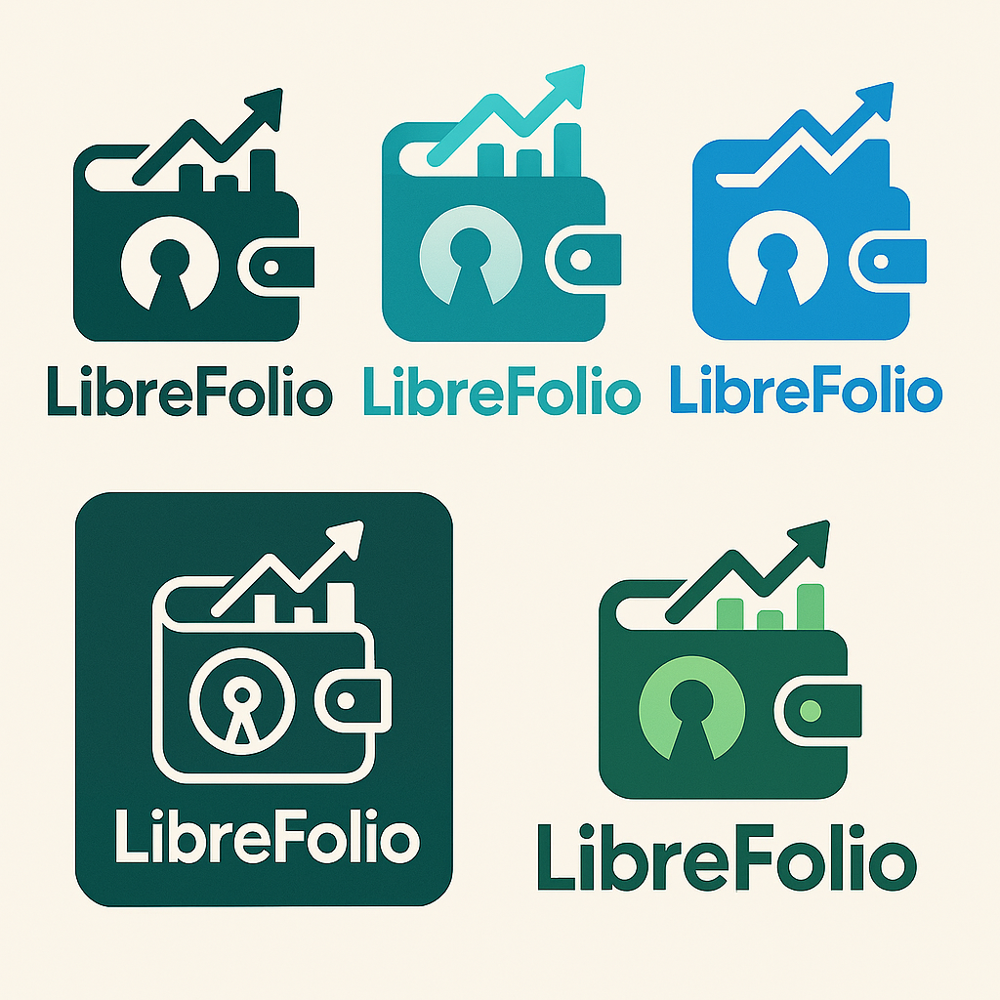

# Welcome to LibreFolio Documentation

**LibreFolio** is a self-hosted, open-source application designed for private and personal tracking of financial investments.

This portal contains all the documentation for users, developers, and contributors.

## 🚀 Quick Links

- **[Getting Started](./getting-started/introduction.md)**: New to LibreFolio? Start here!
- **[Developer Manual](./developer/index.md)**: For contributors and developers.
- **[User Manual](./user/index.md)**: For end-users of the application.

## 🛠️ How to get information about a sub-system

To get information about a specific sub-system an Agent can:

1. Look at the project structure using `ls -R` command
2. Find the correct documentation page and read it
3. Read the code of the file of interest
4. If there are any tests, read them to understand the usage of the file
5. Run the tests to validate the assumptions
